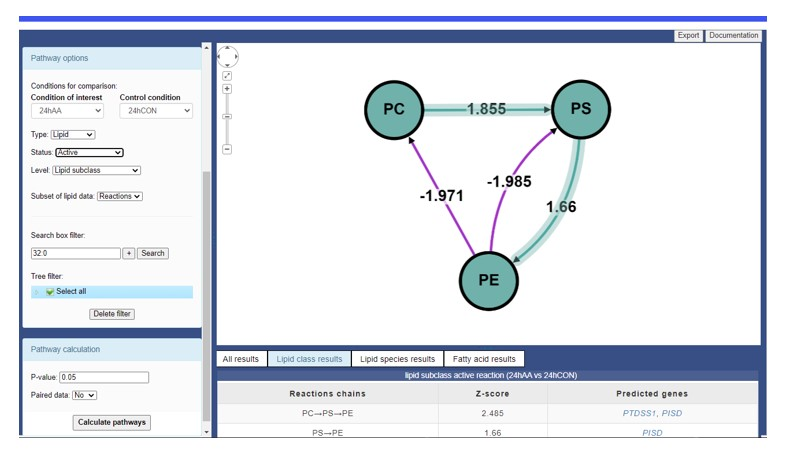

# Introduction

I have created this [post](https://jauntyjjs.github.io/BioPAN_Tutorial/) to explain how the number displayed in the BioPAN software are calculated using a small dataset as an example.

Below is a preview of how it look like.

# About BioPAN

[BioPAN](https://f1000research.com/articles/10-4) (1) is a tool found in [LIPID MAPS](https://lipidmaps.org/biopan) designed to automate biosynthetic pathway analysis of lipids.

Below is a [YouTube video](https://www.youtube.com/watch?v=3OrjRzbCB04) on how to use BioPAN.

<iframe width="560" height="315" src="https://www.youtube.com/embed/3OrjRzbCB04" frameborder="0" allowfullscreen>
</iframe>

# Source Code

The source code of this [post](https://jauntyjjs.github.io/BioPAN_Tutorial/) can be found in this [GitHub respository](https://github.com/JauntyJJS/BioPAN_Tutorial)

# References

1. Gaud C, C. Sousa B, Nguyen A, Fedorova M, Ni Z, O’Donnell V, et al. BioPAN: A web-based tool to explore mammalian lipidome metabolic pathways on LIPID MAPS \[version 1; peer review: 3 approved\]. F1000Research \[Internet\]. 2021;10(4). Available from: <https://f1000research.com/articles/10-4>

