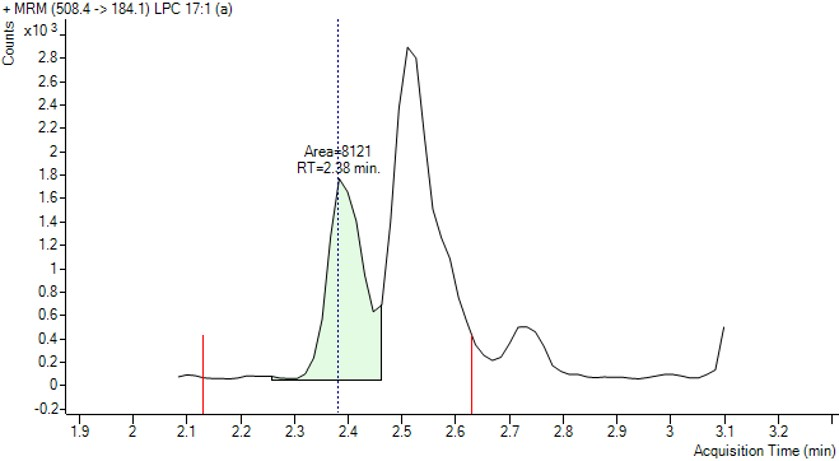
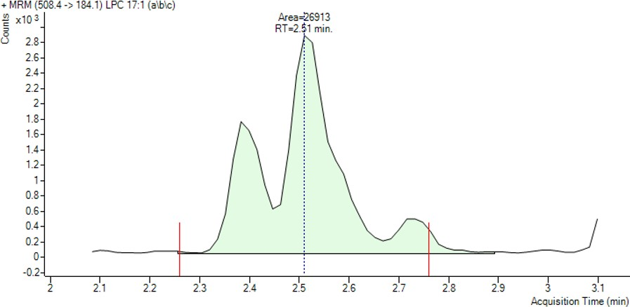
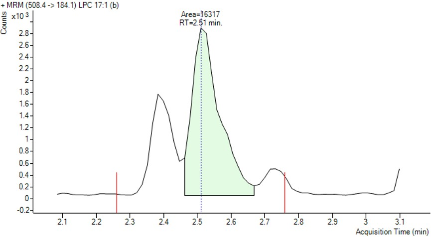
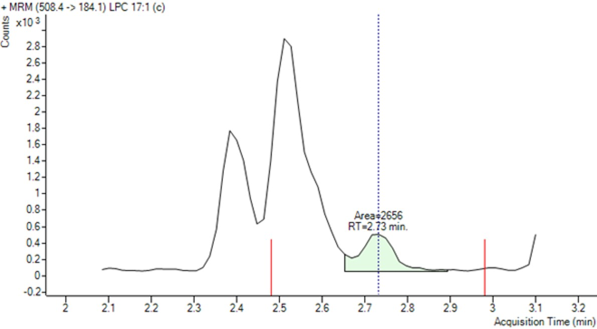
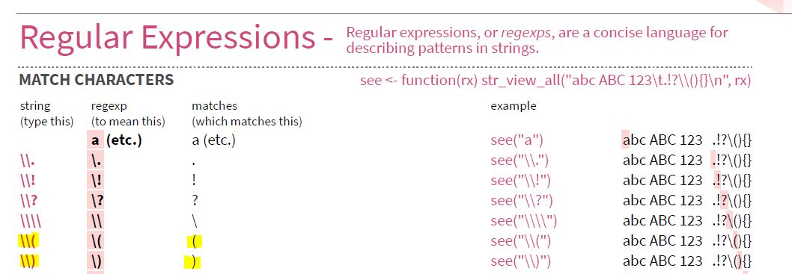
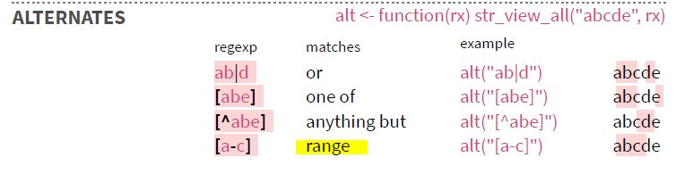
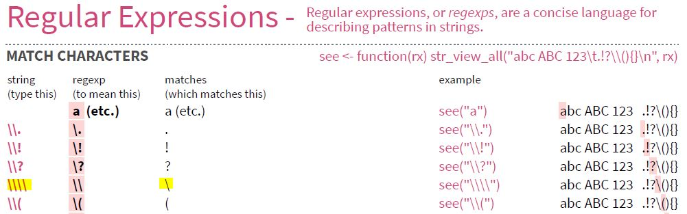
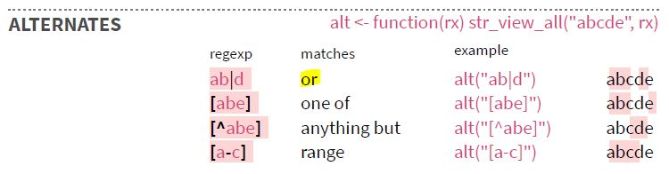
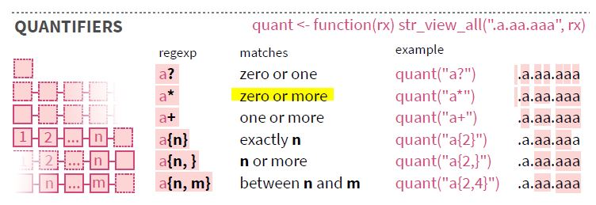

```{r setup, echo=FALSE}
knitr::opts_chunk$set(fig.align = "center")

htmltools::tagList(
  xaringanExtra::use_clipboard(
    button_text = "<i class=\"fa fa-clipboard\"></i> Copy Code",
    success_text = "<i class=\"fa fa-check\" style=\"color: #90BE6D\"></i> Copied!",
  ),
  rmarkdown::html_dependency_font_awesome()
)
```

## Introduction

Despite efforts made to unified lipids shorthand notations and the rise of software dedicated to standardise lipid annotations, lipid names still remains diverse. This is due to limited ways lipid software may label a lipid and/or researchers' personal preferences to annotate them.

Here, I would like to highlight some lipid annotations that my workplace uses and show how to modify them in R such that it can be processed by lipid annotations converter tools like [Goslin](https://lifs-tools.org/goslin) [@GOSLIN] and [RefMet](https://metabolomicsworkbench.org/databases/refmet/index.php) [@Fahy2020].

## R Packages Used

```{r message=FALSE}
library("rgoslin")
library("reactable")
library("here")
library("readxl")
library("magrittr")
library("stringr")
library("dplyr")
library("report")
```

## Labels to clean

Here are the list of lipid names to clean

| Given Name              | Clean Name For Annotation | Precursor Ion | Product Ion |
|-------------------------|---------------------------|---------------|-------------|
| LPC 13:0 (ISTD) (a)     | LPC 13:0                  | 454.3         | 184.1       |
| LPC 13:0 (ISTD) (a\\b)  | LPC 13:0                  | 454.3         | 184.1       |
| LPC 13:0 (ISTD) (b)     | LPC 13:0                  | 454.3         | 184.1       |
| LPC 15:0-d5 (IS) (a)    | LPC 15:0                  | 487.4         | 304.3       |
| LPC 15:0-d5 (IS) (a\\b) | LPC 15:0                  | 487.4         | 304.3       |
| LPC 15:0-d5 (IS) (b)    | LPC 15:0                  | 487.4         | 304.3       |
| LPC 17:1 (a)            | LPC 17:1                  | 508.3         | 184.1       |
| LPC 17:1 (a/b/c)        | LPC 17:1                  | 508.3         | 184.1       |
| LPC 17:1 (b)            | LPC 17:1                  | 508.3         | 184.1       |
| LPC 17:1 (c)            | LPC 17:1                  | 508.3         | 184.1       |
               
The (a\\b) in this case refers to which lipid isomer is integrated. Here is an example with LPC 17:1









The identity of such isomers is still an ongoing research process for most lipids. Thankfully for the case of LPC 17:1 in human plasma. The identity can be found in these links.

-   [LPC 17:1 (a)](https://metabolomics.baker.edu.au/method/mrm/LPC171sn2a)

-   [LPC 17:1 (b)](https://metabolomics.baker.edu.au/method/mrm/LPC171sn1aLPC171sn2b)

-   [LPC 17:1 (c)](https://metabolomics.baker.edu.au/method/mrm/LPC171sn1b)

Unfortunately lipid annotations converter tools like Goslin and RetMet is unable to parse these given names

```{r message=FALSE}
c("LPC 13:0 (ISTD) (a\\b)",
  "LPC 15:0-d5 (IS) (a\\b)",
  "LPC 17:1 (a/b/c) ") %>%
  rgoslin::parseLipidNames()
```

They must be clean up accordingly

```{r message=FALSE}
c("LPC 13:0","LPC 15:0","LPC 17:1") %>%
  rgoslin::parseLipidNames() %>%
  reactable::reactable(defaultPageSize = 5)
```

The task is to remove the variations of (ISTD), (a\\b) and the -d5


## Read Data

```{r read_data, warning=FALSE, message=FALSE}
annotation_data <- readxl::read_excel(
  path = here::here("content", 
                    "blog",
                    "2022-01-22-Clean-Lipid-Names-1",
                    "Annotation.xlsx"),
  sheet = "Transition_Name_Annot"
  )

reactable::reactable(annotation_data, defaultPageSize = 5)
```

## The Plan

We will do the following in order

1.  Remove the -d5

2.  Remove the ISTD and its variations

3.  Remove the (a\\b\\c) and its variations

The idea is to first use `stringr::str_view` to check what the matched pattern is. Once the matched pattern is correct, we can use `stringr::str_remove` function to clean up the matched pattern.

## Remove -d5

Here is an example to remove the -d5 using `stringr::str_view`. Simply just set the pattern as "-d5"

```{r, warning=FALSE, message=FALSE}
stringr::str_view("LPC 15:0-d5 (IS) (a)", pattern = "-d5")
stringr::str_remove("LPC 15:0-d5 (IS) (a)", pattern = "-d5")
```

## Remove the ISTD variation

The first challenge is to create a pattern that is able to remove variations of ISTD such as `(ISTD)` and `(IS)`

##### Detect the word ISTD

To detect the word ISTD, we can do this in R

```{r, warning=FALSE, message=FALSE}
stringr::str_view("LPC 13:0 (ISTD) (a)", pattern = "ISTD")
```

Unfortunately, this will not work with the word IS

```{r, warning=FALSE, message=FALSE}
stringr::str_view("LPC 15:0-d5 (IS) (a)", pattern = "ISTD")
```

Alternatively to detect the word IS, we can do this in R

```{r, warning=FALSE, message=FALSE}
stringr::str_view("LPC 15:0-d5 (IS) (a)", pattern = "IS")
```

This time, this will not work with the word ISTD

```{r, warning=FALSE, message=FALSE}
stringr::str_view("LPC 13:0 (ISTD) (a)", pattern = "IS")
```

To detect words of the form IS and ISTD, we can make use of the fact that the group "TD" in "ISTD" appear zero or one time. Referring to the cheat sheet of `stringr`, we can make use of parentheses to create a group.

Hence, adding the group to the existing pattern, we have the form `IS(TD)`.

Next, we inform `stringr` that the group `(TD)` can appear zero or one time. Referring to the cheat sheet of `stringr`, we can make use of the `?` symbol

This give our updated pattern to `IS(TD)?`

Putting this to our existing list of words, we have

```{r, warning=FALSE, message=FALSE}
stringr::str_view(annotation_data$`Given Name`, pattern = "IS(TD)?")
```

### Detect Parenthesis

The way to detect `(` and `)` is unfortunately not as simple as `stringr::str_view_all("LPC 13:0 (ISTD) (a)", pattern = "(")`, giving rise to this error message.

```{r, error=TRUE}
stringr::str_view_all("LPC 13:0 (ISTD) (a)", pattern = "(")
```

This is because `(` and `)` fall under a group called "meta characters" that have other functions in regular expression. In fact, we have just explained what it does earlier which is to group characters together.

To inform that we want to search for the pattern `(` and `)` explicitly. We need to add two escape character `\\` as indicated in the stringr cheat sheet.



```{r detect_parenthesis, warning=FALSE, message=FALSE}

stringr::str_view_all("LPC 13:0 (ISTD) (a)", pattern = "\\(")
stringr::str_view_all("LPC 13:0 (ISTD) (a)", pattern = "\\)")
```

Putting it all together, we have the pattern `\\(IS(TD)?\\)`

```{r clean_istd, warning=FALSE, message=FALSE}

stringr::str_view_all(annotation_data$`Given Name`, pattern = "\\(IS(TD)?\\)")
```

## Remove (a\\b\\c) and its variations

The second challenge is to create a pattern to remove variations of (a\\b\\c).

Things that are consistent is that they are written in small letters.

However, the main issue I faced when dealing with this variation

-   The letter does not always start with `a`

-   The list of letters can be separated by `\` or `/`

-   The list can expand indefinitely. For example, it can be

    -   (a\\b\\...\\f)

    -   (b\\d\\f)

Here is what I have done to resolve the above issues.

### Letter does not always start with `a`

To create a pattern that matches small letters from a to z, we can use the square brackets `[` and `]` and hyphen `-` as indicated in the stringr cheat sheet.



Applying what we have learnt, we have the pattern `\\([a-z]\\)`. The `a-z` means the range from a to z. The square brackets `[` and `]` means one of. Hence `[a-z]` is telling the software to look for one of the letters ranging from a to z.

```{r start_with_a, warning=FALSE, message=FALSE}

stringr::str_view_all(annotation_data$`Given Name`, pattern = "\\([a-z]\\)")
```

### The list of letters can be separated by `\` or `/`

Matching `/` is easy.

```{r pattern_frontslash, warning=FALSE, message=FALSE}

stringr::str_view_all("LPC 17:1 (a/b/c)", pattern = "/")
```

but not so for `\`

```{r, error=TRUE}
stringr::str_view_all("LPC 13:0 (ISTD) (a\\b)", pattern = "\\")
```

`\` also fall under a group called "meta characters". Referring to the stringr cheat sheet, to search for the pattern `/` explicitly. We use four escape characters `\\\\`



```{r pattern_backslash, warning=FALSE, message=FALSE}

stringr::str_view_all("LPC 13:0 (ISTD) (a\\b)", pattern = "\\\\")
```

The question now is how do we incorporate "or" into the pattern. Referring again to the stringr cheat sheet, it is `|`



The pattern therefore is `[\\\\|/]` as we are looking for one of `/` or `\`

```{r pattern_backslash_or_frontslash, warning=FALSE, message=FALSE}

stringr::str_view_all(c("LPC 13:0 (ISTD) (a\\b)", "LPC 17:1 (a/b/c)"), pattern = "[\\\\|/]")
```

### List can expand indefinitely

This one is a bit tricky. The pattern (a\\b\\...\\f) and (a/b/c) can be viewed as

(\[some small letter\]`[\ or /][some small letter]`)

where the whole pattern `[\ or /][some small letter]` appears zero or more times.

To add the element of zero or more times, we use the `*` character



This gives the pattern `([\\\\|/][a-z])*`. The parenthesis `()` is to ensure the whole pattern `{\ or /}{some small letter}` appears zero or more times.

Putting the three solution altogether, we have the pattern `\\([a-z]([\\\\|/][a-z])*\\)`

```{r list_expand_indefinitely, warning=FALSE, message=FALSE}

stringr::str_view_all(annotation_data$`Given Name`, pattern = "\\([a-z]([\\\\|/][a-z])*\\)")
```

## Plan Execution

With the three removal plan set, we can clean the transition name as follows.

```{r plan_execution, warning=FALSE, message=FALSE}

Clean_Name <- annotation_data[["Given Name"]] %>%
  stringr::str_remove(pattern = "-d5") %>%
  stringr::str_remove(pattern = "\\(IS(TD)?\\)") %>%
  stringr::str_remove(pattern = "\\([a-z]([\\\\|/][a-z])*\\)") %>%
  stringr::str_trim()

annotation_data %>%
  # Create a new column with the Clean Names
  dplyr::mutate(`Clean Name For Annotation` = Clean_Name) %>%
  # Make Given Name and Clean Name the first two columns
  dplyr::relocate(
    dplyr::any_of(c("Given Name","Clean Name For Annotation"))
    ) %>%
  reactable::reactable(defaultPageSize = 5)
```

## Package References

```{r warning=FALSE, message=TRUE, results='asis'}
report::cite_packages(sessionInfo())
```

## References
