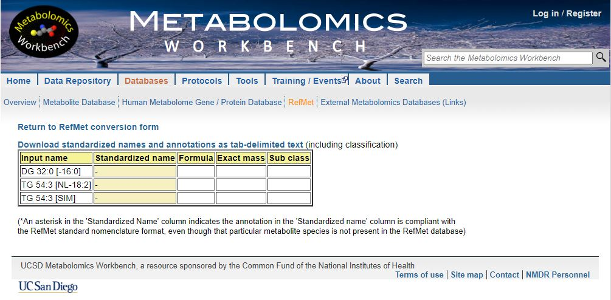

```{r setup, echo=FALSE}
knitr::opts_chunk$set(fig.align = "center")

```

## Introduction

In this blog, I will introduce another set of lipid annotations that my workplace uses that require to be cleaned up and modified so that they can be processed by lipid annotations converter tools like [Goslin](https://lifs-tools.org/goslin) [@GOSLIN] and [RefMet](https://metabolomicsworkbench.org/databases/refmet/index.php) [@Fahy2020].

## R Packages Used

```{r message=FALSE}
library("rgoslin")
library("reactable")
library("flair")
library("here")
library("readxl")
library("magrittr")
library("stringr")
library("dplyr")
library("report")
```

## Labels to clean

Here are the list of lipid names to clean

| Given Name             | Clean Name For Annotation | Precursor Ion | Product Ion |
|------------------------|---------------------------|---------------|-------------|
| DG 32:0 \[-16:0\]      | DG 16:0_16:0              | 586.5         | 313.3       |
| DG 36:1 \[NL-18:1\]    | DG 18:1_18:0              | 640.6         | 341.3       |
| TG 54:3 \[-18:1\]      | TG 18:1_36:2              | 902.8         | 603.5       |
| TG 54:3 \[NL-18:2\]    | TG 18:2_36:1              | 902.8         | 605.5       |
| TG 54:3 \[SIM\]        | TG 54:3                   | 902.8         | 902.8       |

Unfortunately lipid annotations converter tools like Goslin and RetMet is unable to parse these given names

```{r message=FALSE}
c("DG 32:0 [-16:0]",
  "TG 54:3 [NL-18:2]") %>%
  rgoslin::parseLipidNames()
```



They must be clean up accordingly

```{r message=FALSE}
c("DG 16:0_16:0",
  "TG 18:2_36:1") %>%
  rgoslin::parseLipidNames() %>%
  reactable::reactable(defaultPageSize = 5)
```


## Read Data

```{r read_data, warning=FALSE, message=FALSE}
annotation_data <- readxl::read_excel(
  path = here::here("content", 
                    "blog",
                    "2022-03-01-Clean-Lipid_Names-2",
                    "Annotation.xlsx"),
  sheet = "Transition_Name_Annot"
  )

reactable::reactable(annotation_data, defaultPageSize = 5)
```

## The Plan

We can split this complex task in the following steps

-   Find those transition names that ends with \[SIM\], remove the \[SIM\] and return it

Transition names from here on should only be those that are measuring neutral loss a particular fatty acid chain.

We then need to do the following steps to clean such transition names.

-   Get the acyl class of the transition.

-   Get the total carbon number of the transition.

-   Get the total number of double bond of the transition

-   Get the total carbon number of the measured fatty acid chain.

-   Get the total number of double bond of the measured fatty acid chain.

-   Use the tools above to clean the transition name.

We begin with an empty generic function

```{r message=FALSE}

clean_acyl <- function(input_acyl = "DG 32:0 [NL-16:0]") {
  return(input_acyl)
}

```

## Remove [SIM] at the end

The square brackets `[` and `]` means one of in regular expression. For example, pattern `[a-z]` is telling the software to look for one of the letters ranging from a to z.

### Remember the backslash `\`

To allow the software to look explicitly for the pattern `[` and `]`, we need to use the backslash `\` giving us `\[` and `\]`. However, whenever `\` appears in a regular expression, we must write as `\\` instead in R. Doing so gives us `\\[` and `\\]`

Using `TG 54:3 [SIM]` as an example, we have

```{r message=FALSE}
stringr::str_remove(string = "TG 54:3 [SIM]" ,pattern = "\\[SIM\\]")
```
### Removing the whitespaces

Now here you can see that the white spaces is not removed. One way is to use `stringr::str_trim()`

```{r message=FALSE}
stringr::str_remove(string = "TG 54:3 [SIM]" ,pattern = "\\[SIM\\]") %>%
  stringr::str_trim()
```
Another way is to add white spaces in our pattern `\\[SIM\\]`. Taking a look at the stringr cheat sheet, we can try to use `\\s`.


To show that we need to remove zero of more whitespaces, we add the "*"


This expands the pattern to `\\s*\\[SIM\\]\\s*`

```{r message=FALSE}
stringr::str_remove(string = "TG 54:3 [SIM]  " ,pattern = "\\s*\\[SIM\\]\\s*") %>%
  stringr::str_trim()
```

### Indicating the end of a string

To be more specific that we need to remove "[SIM]" only at the end of the string. We add `$` at the end of the pattern: `\\s*\\[SIM\\]\\s*$`


```{r message=FALSE}
stringr::str_remove(string = c ("TG 54:3 [SIM]  ",
                                " [SIM] TG 54:3"),
                    pattern = "\\s*\\[SIM\\]\\s*$") %>%
  stringr::str_trim()
```

### Using `isTRUE` in an if statement


```{r remove_sim, message=FALSE, include = FALSE}

clean_acyl <- function(input_acyl = "DG 30:0 [NL-15:0]") {
  
  # If we have a sum composition labelled as [SIM] at the end,
  # remove it and return the results
  if (isTRUE(stringr::str_detect(string = input_acyl,
                                 pattern = "\\s*\\[SIM\\]\\s*$")))
  {
    input_acyl <- input_acyl %>%
      stringr::str_remove(pattern = "\\s*\\[SIM\\]\\s*$")
    
    return(input_acyl)
  }
  
  return(input_acyl)
}

```

```{r, echo = FALSE}

flair::decorate("remove_sim") %>% 
  flair::flair('pattern = \"\\\\s*\\\\[SIM\\\\]\\\\s*$\"') %>% 
  flair::knit_print.with_flair()
  
```

Putting it all together, we have the following function and corresponding documentation.

```{r message=FALSE}
#' @title Clean Acyl Lipids
#' @description Clean Acyl Lipids for `rgoslin` input
#' @param input_acyl A character string highlighting a lipid,
#' Default: 'DG 30:0 \[NL-15:0\]'
#' @return A acyl lipid that `rgoslin` can accept
#' @details We only accept DG, DAG, TG, TAG for now.
#' Input Acyl Lipid is of the form
#' {acyl_class} {total_C}:{total_DB} \[NL-{measured_C}:{measured_DB}\]
#' where C is carbon and DB is double bond
#' Output Acyl Lipid is of the form
#' {acyl_class} {measured_C}:{measured_DB}_{remaining_C}:{remaining_DB}
#' where {remaining_C} is {total_C - measured_C}
#' and {remaining_DB} is {total_DB - measured_DB}
#' @examples
#' clean_acyl_dynamo(input_acyl = "DG 30:0 -15:0")
#' @rdname clean_acyl
#' @export
clean_acyl <- function(input_acyl = "DG 30:0 [NL-15:0]") {

  # If we have a sum composition labelled as [SIM] at the end
  # after removing the (a\b) and (ISTD)
  if(isTRUE(stringr::str_detect(string = input_acyl,
                         pattern = "\\s*\\[SIM\\]\\s*$"))) {

    input_acyl <- input_acyl %>%
      stringr::str_remove(pattern = "\\s*\\[SIM\\]\\s*$")

    return(input_acyl)

  }

  # If we have no neutral loss labeling
  if(!isTRUE(stringr::str_detect(string = input_acyl,
                                pattern = "\\s*(\\[)?(NL)?-\\s*\\d+:\\d+(\\])?\\s*$"))) {

    return(input_acyl)

  }

  # From here all should end with [NL-XX:X]

  acyl_class <- input_acyl %>%
    stringr::str_extract(pattern = "^[D|T]A?G")

  total_C <- input_acyl %>%
    stringr::str_remove(pattern = stringr::str_glue("{acyl_class}\\s*")) %>%
    stringr::str_extract(pattern = "^\\d+:\\d+") %>%
    stringr::str_extract(pattern = "^\\d+")

  total_DB <- input_acyl %>%
    stringr::str_remove(pattern = stringr::str_glue("{acyl_class}\\s*")) %>%
    stringr::str_extract(pattern = "^\\d+:\\d+") %>%
    stringr::str_extract(pattern = "\\d+$")

  measured_C <- input_acyl %>%
    stringr::str_remove(pattern = stringr::str_glue("{acyl_class}\\s*")) %>%
    stringr::str_extract(pattern = "-\\s*\\d+:\\d+") %>%
    stringr::str_remove(pattern = "-") %>%
    stringr::str_extract(pattern = "^\\d+")

  measured_DB <- input_acyl %>%
    stringr::str_remove(pattern = stringr::str_glue("{acyl_class}\\s*")) %>%
    stringr::str_extract(pattern = "-\\s*\\d+:\\d+") %>%
    stringr::str_remove(pattern = "-") %>%
    stringr::str_extract(pattern = "\\d+$")

  if(!isTRUE(stringr::str_detect(total_C, "^[0-9]+$"))) {
    stop(glue::glue("Extracting total carbon in {input_acyl} has failed"))
  }

  if(!isTRUE(stringr::str_detect(total_DB, "^[0-9]+$"))) {
    stop(glue::glue("Extracting total double bond in {input_acyl} has failed"))
  }

  if(!isTRUE(stringr::str_detect(measured_C, "^[0-9]+$"))) {
    stop(glue::glue("Extracting measured carbon in {input_acyl} has failed"))
  }

  if(!isTRUE(stringr::str_detect(measured_DB, "^[0-9]+$"))) {
    stop(glue::glue("Extracting measured double bond in {input_acyl} has failed"))
  }

  remaining_C <- (as.numeric(total_C) - as.numeric(measured_C)) %>%
    as.character()

  remaining_DB <- (as.numeric(total_DB) - as.numeric(measured_DB)) %>%
    as.character()

  clean_acyl <- stringr::str_glue(
    "{acyl_class} {measured_C}:{measured_DB}_{remaining_C}:{remaining_DB}"
  ) %>%
    as.character()

  return(clean_acyl)

}
```


## References
