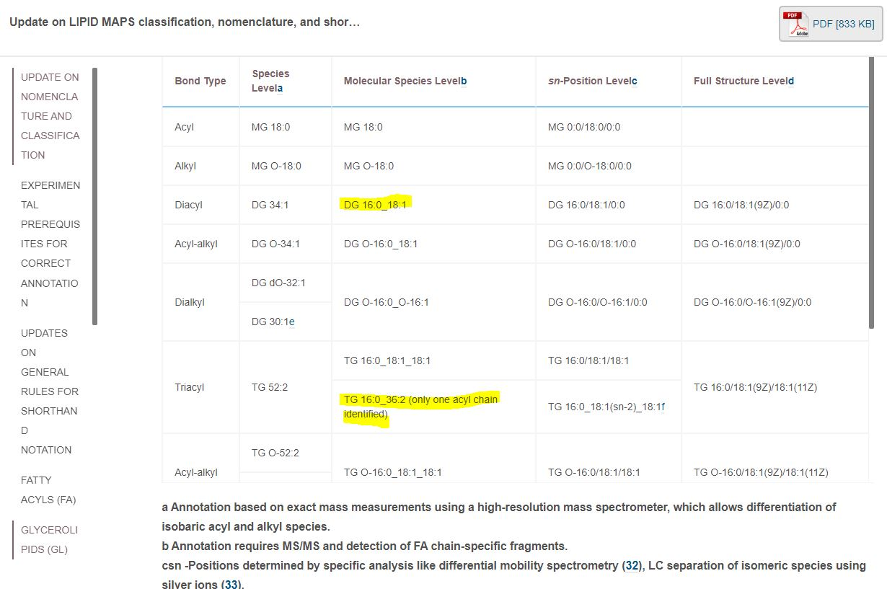
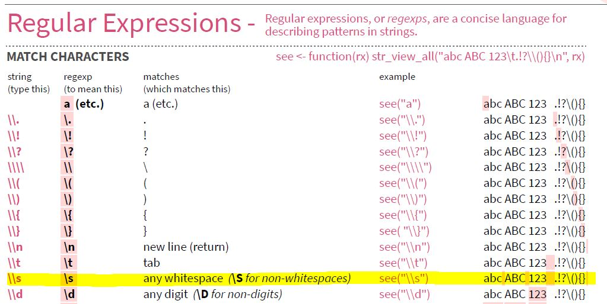

```{r setup, echo=FALSE}
knitr::opts_chunk$set(fig.align = "center")

htmltools::tagList(
  xaringanExtra::use_clipboard(
    button_text = "<i class=\"fa fa-clipboard\"></i> Copy Code",
    success_text = "<i class=\"fa fa-check\" style=\"color: #90BE6D\"></i> Copied!",
  ),
  rmarkdown::html_dependency_font_awesome()
)
```

## Introduction

In this blog, I will introduce another set of lipid annotations that my workplace uses that require to be cleaned up and modified so that they can be processed by lipid annotations converter tools like [Goslin](https://lifs-tools.org/goslin) [@GOSLIN] and [RefMet](https://metabolomicsworkbench.org/databases/refmet/index.php) [@Fahy2020].

## R Packages Used

```{r message=FALSE}
library("rgoslin")
library("reactable")
library("flair")
library("here")
library("readxl")
library("magrittr")
library("stringr")
library("dplyr")
library("report")
```

## Labels to clean

Here are the list of lipid names to clean

| Given Name          | Clean Name For Annotation | Precursor Ion | Product Ion |
|---------------------|---------------------------|---------------|-------------|
| DG 32:0 \[-16:0\]   | DG 16:0_16:0              | 586.5         | 313.3       |
| DG 36:1 \[NL-18:1\] | DG 18:1_18:0              | 640.6         | 341.3       |
| TG 54:3 \[-18:1\]   | TG 18:1_36:2              | 902.8         | 603.5       |
| TG 54:3 \[NL-18:2\] | TG 18:2_36:1              | 902.8         | 605.5       |
| TG 54:3 \[SIM\]     | TG 54:3                   | 902.8         | 902.8       |

The word [SIM] stands for [selected ion monitoring](https://en.wikipedia.org/wiki/Selected_ion_monitoring).
SIM is used to detect TG species with a known total number of carbon atoms and double bonds. In the case of
TG 54:3 [SIM], the total number of carbon atom is 54 and double bonds is 3.

There are several limitations of this acquisition mode as indicated by [Xianlin et. al.](https://pubs.acs.org/doi/10.1021/acs.jafc.0c07175) [@Han2021]. One of them is that this method is unable to give information about the fatty acyl chains. As a result, multiple precursor ion and neutral loss (NL) scan mode 
were introduced to identify potential fatty acyl chains that can be attached to the TG. For example, TG 54:3 [NL-18:2] measures the amount of fatty acyl chain 18:2 attached to TG 54:3 while TG 54:3 [-18:3] measures the amount of fatty acyl chain 18:3 attached to TG 54:3 instead.


Unfortunately lipid annotations converter tools like [Goslin](https://lifs-tools.org/goslin) and [RefMet](https://metabolomicsworkbench.org/databases/refmet/index.php) are unable to parse these given names

```{r message=FALSE}
c("DG 32:0 [-16:0]",
  "TG 54:3 [NL-18:2]",
  "TG 54:3 [SIM]") %>%
  rgoslin::parseLipidNames()
```


They must be clean up accordingly as indicated in [Gerhard et. al.](https://www.jlr.org/article/S0022-2275(20)60017-7/fulltext) [@Liebisch2020]



A positive result should look like the following. 

```{r message=FALSE}
c("DG 16:0_16:0",
  "TG 18:2_36:1",
  "TG 54:3") %>%
  rgoslin::parseLipidNames() %>%
  reactable::reactable(defaultPageSize = 5)
```

 ## Read Data

## Read Data

```{r read_data, warning=FALSE, message=FALSE}
annotation_data <- readxl::read_excel(
  path = here::here("content", 
                    "blog",
                    "2022-03-07-Clean-Lipid-Names-2",
                    "Annotation.xlsx"),
  sheet = "Transition_Name_Annot"
  )

reactable::reactable(annotation_data, defaultPageSize = 5)
```

## The Plan

We can split this complex task in the following steps

-   Find those transition names that ends with [SIM], remove the [SIM] and return it

Transition names from here on should only be those that are measuring neutral loss a particular fatty acid chain.

We then need to do the following steps to clean such transition names.

-   Get the acyl class of the transition.

-   Get the total carbon number of the transition.

-   Get the total number of double bond of the transition

-   Get the total carbon number of the measured fatty acid chain.

-   Get the total number of double bond of the measured fatty acid chain.

-   Use the tools above to clean the transition name.

In this blog, we will focus only on doing the first part which is to remove the [SIM]


## Remove [SIM] at the end

We begin with an empty generic function

```{r message=FALSE}

clean_acyl <- function(input_acyl = "DG 32:0 [NL-16:0]") {
  return(input_acyl)
}

```

The square brackets `[` and `]` means one of in regular expression. For example, pattern `[a-z]` is telling the software to look for one of the letters ranging from a to z.

### Remember the backslash `\`

To allow the software to look explicitly for the pattern `[` and `]`, we need to use the backslash `\` giving us `\[` and `\]`. However, whenever `\` appears in a regular expression, we must write as `\\` instead in R. Doing so gives us `\\[` and `\\]`

Using `TG 54:3 [SIM]` as an example, we have

```{r message=FALSE, echo = FALSE, results = FALSE}
stringr::str_remove(string = "TG 54:3 [SIM]" ,pattern = "\\[SIM\\]")
```

```{r find_sim, message=FALSE, include = FALSE}
stringr::str_remove(string = "TG 54:3 [SIM]" ,pattern = "\\[SIM\\]")
```

```{r, echo = FALSE}
flair::decorate("find_sim") %>% 
  flair::flair('pattern = \"\\\\[SIM\\\\]"',
               background = "#d2f8d2") %>% 
  flair::knit_print.with_flair()
```

### Removing the whitespaces

Now here you can see that the white spaces is not removed. One way is to use `stringr::str_trim()`

```{r message=FALSE, echo = FALSE, results = FALSE}
stringr::str_remove(string = "TG 54:3 [SIM]" ,pattern = "\\[SIM\\]") %>%
  stringr::str_trim()
```

```{r remove_whitespaces, message=FALSE, include = FALSE}
stringr::str_remove(string = "TG 54:3 [SIM]" ,pattern = "\\[SIM\\]") %>%
  stringr::str_trim()
```

```{r, echo = FALSE}
flair::decorate("remove_whitespaces") %>% 
  flair::flair('stringr::str_trim()',
               background = "#d2f8d2") %>% 
  flair::knit_print.with_flair()
```

Another way is to add white spaces in our pattern `\\[SIM\\]`. Taking a look at the `stringr` cheat sheet, we can try to use `\\s`.



To show that we need to remove zero of more whitespaces, we add the "\*"


This expands the pattern to `\\s*\\[SIM\\]\\s*`

```{r message=FALSE, echo = FALSE, results = FALSE}
stringr::str_remove(string = "TG 54:3 [SIM]  ", pattern = "\\s*\\[SIM\\]\\s*")
```

```{r remove_whitespaces_2, message=FALSE, include = FALSE}
stringr::str_remove(string = "TG 54:3 [SIM]  ", pattern = "\\s*\\[SIM\\]\\s*")
```

```{r, echo = FALSE}
flair::decorate("remove_whitespaces_2") %>% 
  flair::flair('\\\\s*',
               background = "#d2f8d2") %>% 
  flair::knit_print.with_flair()
```

### Indicating the end of a string

To be more specific that we need to remove [SIM] only at the end of the string. We add `$` at the end of the pattern: `\\s*\\[SIM\\]\\s*$`


```{r message=FALSE, echo = FALSE, results = FALSE}
stringr::str_remove(string = c ("TG 54:3 [SIM]  ",
                                " [SIM] TG 54:3"),
                    pattern = "\\s*\\[SIM\\]\\s*$")
```

```{r end_of_string, message=FALSE, include = FALSE}
stringr::str_remove(string = c ("TG 54:3 [SIM]  ",
                                " [SIM] TG 54:3"),
                    pattern = "\\s*\\[SIM\\]\\s*$")
```

```{r, echo = FALSE}
flair::decorate("end_of_string") %>% 
  flair::flair('$',
               background = "#d2f8d2") %>% 
  flair::knit_print.with_flair()
```

### Using `isTRUE` in an if statement

Now that we know how to remove the [SIM] at the end, we need to create an if statement to detect that such a pattern exists. This is because after the [SIM] is removed, the transition names **do not** need to be modified further and the cleaned name can be returned.

One way to do this is to use `stringr::str_detect` to do the job

```{r message=FALSE, echo = FALSE, results = FALSE}

clean_acyl <- function(input_acyl = "DG 32:0 [NL-16:0]") {
  
  # If we have a sum composition labelled as [SIM] at the end,
  # remove it and return the results
  if (stringr::str_detect(string = input_acyl,
                           pattern = "\\s*\\[SIM\\]\\s*$"))
  {
    input_acyl <- input_acyl %>%
      stringr::str_remove(pattern = "\\s*\\[SIM\\]\\s*$")
    
    return(input_acyl)
  }
  
  return(input_acyl)
}

```

```{r str_detect, message=FALSE, include = FALSE}
clean_acyl <- function(input_acyl = "DG 32:0 [NL-16:0]") {
  
  # If we have a sum composition labelled as [SIM] at the end,
  # remove it and return the results
  if (stringr::str_detect(string = input_acyl,
                           pattern = "\\s*\\[SIM\\]\\s*$"))
  {
    input_acyl <- input_acyl %>%
      stringr::str_remove(pattern = "\\s*\\[SIM\\]\\s*$")
    
    return(input_acyl)
  }
  
  return(input_acyl)
}
```

```{r, echo = FALSE}
flair::decorate("str_detect") %>% 
  flair::flair('stringr::str_detect',
               background = "#d2f8d2") %>% 
  flair::knit_print.with_flair()
```

However, there is a possibility that `stringr::str_detect` may not return a boolean value due to an unusual input. This may give an error to the if statement. Here are some examples

```{r, error=TRUE}
if(stringr::str_detect(string = NULL, pattern = "\\s*\\[SIM\\]\\s*$")) {
  print("No error")
}
```

```{r, error=TRUE}
if(stringr::str_detect(string = NA, pattern = "\\s*\\[SIM\\]\\s*$")) {
  print("No error")
}
```

To rectify this issue, we make use of the function `isTRUE` which gives the boolean value `FALSE`, when it receives such unusual input.

```{r, message=FALSE, echo = FALSE, results = FALSE}
isTRUE(stringr::str_detect(string = NULL, pattern = "\\s*\\[SIM\\]\\s*$"))
```
```{r isTRUE_example_1, message=FALSE, include = FALSE}
isTRUE(stringr::str_detect(string = NULL, pattern = "\\s*\\[SIM\\]\\s*$"))
```

```{r, echo = FALSE}
flair::decorate("isTRUE_example_1") %>% 
  flair::flair('isTRUE',
               background = "#d2f8d2") %>%
  flair::flair('NULL',
               background = "#fbbfd1") %>% 
  flair::knit_print.with_flair()
```

```{r, message=FALSE, echo = FALSE, results = FALSE}
isTRUE(stringr::str_detect(string = NA, pattern = "\\s*\\[SIM\\]\\s*$"))
```

```{r isTRUE_example_2, message=FALSE, include = FALSE}
isTRUE(stringr::str_detect(string = NA, pattern = "\\s*\\[SIM\\]\\s*$"))
```

```{r, echo = FALSE}
flair::decorate("isTRUE_example_2") %>% 
  flair::flair('isTRUE',
               background = "#d2f8d2") %>%
  flair::flair('NA',
               background = "#fbbfd1") %>% 
  flair::knit_print.with_flair()
```

Putting it all together, we have the following so far.

```{r remove_sim, message=FALSE, include = FALSE}

clean_acyl <- function(input_acyl = "DG 32:0 [NL-16:0]") {
  
  # If we have a sum composition labelled as [SIM] at the end,
  # remove it and return the results
  if (isTRUE(stringr::str_detect(string = input_acyl,
                                 pattern = "\\s*\\[SIM\\]\\s*$")))
  {
    input_acyl <- input_acyl %>%
      stringr::str_remove(pattern = "\\s*\\[SIM\\]\\s*$")
    
    return(input_acyl)
  }
  
  return(input_acyl)
}

```

```{r, echo = FALSE}

flair::decorate("remove_sim") %>% 
  flair::flair('pattern = \"\\\\s*\\\\[SIM\\\\]\\\\s*$\"',
               background = "#d2f8d2") %>% 
  flair::knit_print.with_flair()
  
```

## Plan Execution

Here is how it looks like when the function is utilised.

```{r plan_execution, warning=FALSE, message=FALSE}

clean_acyl("TG 54:3 [SIM]")

```

Stay tuned for the next part where we will expand the function to deal with the second part of the plan which is to deal with transitions that indicate a neutral loss of fatty acid chains.

| Given Name          | Clean Name For Annotation | Precursor Ion | Product Ion |
|---------------------|---------------------------|---------------|-------------|
| DG 32:0 \[-16:0\]   | DG 16:0_16:0              | 586.5         | 313.3       |
| DG 36:1 \[NL-18:1\] | DG 18:1_18:0              | 640.6         | 341.3       |
| TG 54:3 \[-18:1\]   | TG 18:1_36:2              | 902.8         | 603.5       |
| TG 54:3 \[NL-18:2\] | TG 18:2_36:1              | 902.8         | 605.5       |

## Package References

```{r warning=FALSE, message=TRUE, results='asis'}
report::cite_packages(sessionInfo())
```

## References
