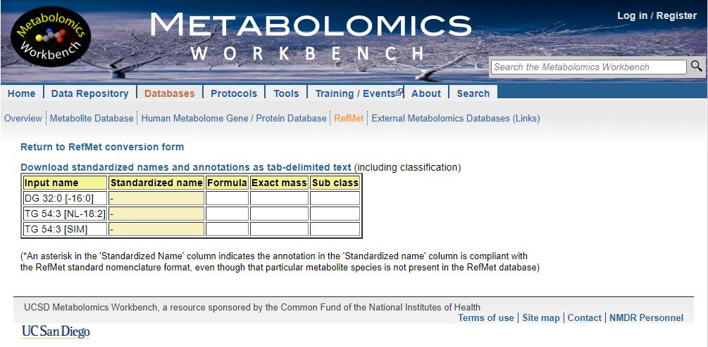
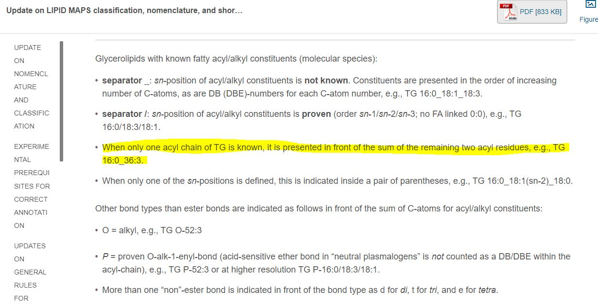
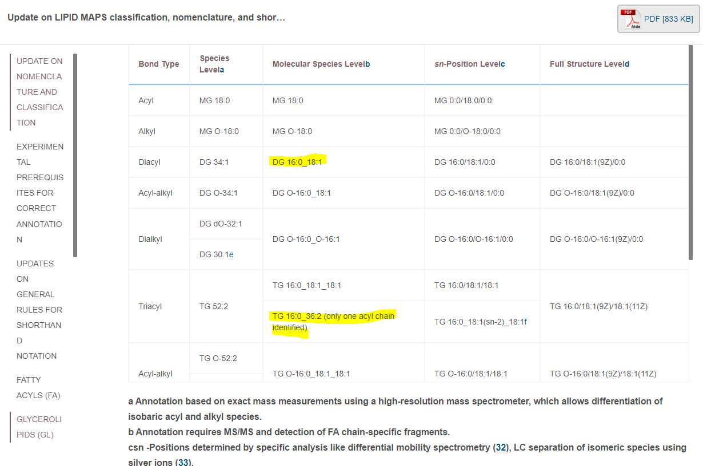
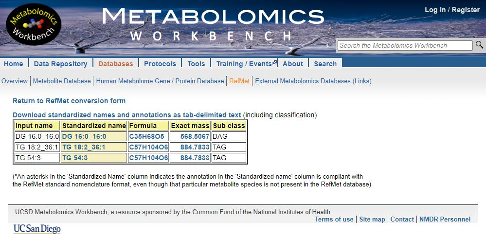
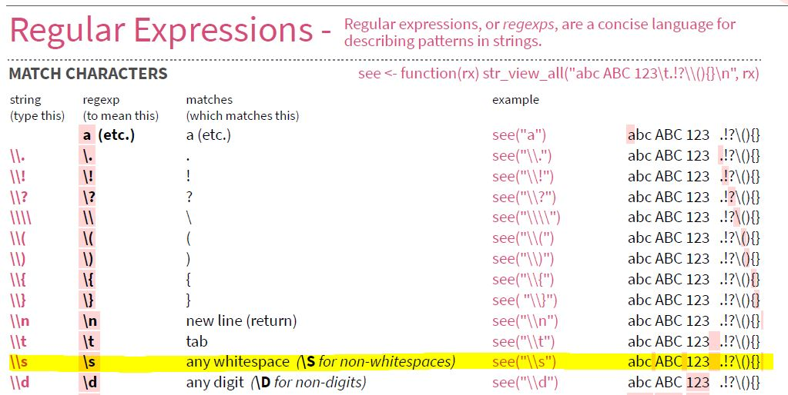
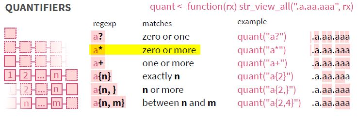
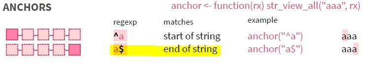

<script src="index_files/clipboard/clipboard.min.js"></script>
<link href="index_files/xaringanExtra-clipboard/xaringanExtra-clipboard.css" rel="stylesheet" />
<script src="index_files/xaringanExtra-clipboard/xaringanExtra-clipboard.js"></script>
<script>window.xaringanExtraClipboard(null, {"button":"<i class=\"fa fa-clipboard\"><\/i> Copy Code","success":"<i class=\"fa fa-check\" style=\"color: #90BE6D\"><\/i> Copied!","error":"Press Ctrl+C to Copy"})</script>
<link href="index_files/font-awesome/css/all.css" rel="stylesheet" />
<link href="index_files/font-awesome/css/v4-shims.css" rel="stylesheet" />
<script src="index_files/core-js/shim.min.js"></script>
<script src="index_files/react/react.min.js"></script>
<script src="index_files/react/react-dom.min.js"></script>
<script src="index_files/reactwidget/react-tools.js"></script>
<script src="index_files/htmlwidgets/htmlwidgets.js"></script>
<script src="index_files/reactable-binding/reactable.js"></script>
<script src="index_files/core-js/shim.min.js"></script>
<script src="index_files/react/react.min.js"></script>
<script src="index_files/react/react-dom.min.js"></script>
<script src="index_files/reactwidget/react-tools.js"></script>
<script src="index_files/htmlwidgets/htmlwidgets.js"></script>
<script src="index_files/reactable-binding/reactable.js"></script>
<script src="index_files/core-js/shim.min.js"></script>
<script src="index_files/react/react.min.js"></script>
<script src="index_files/react/react-dom.min.js"></script>
<script src="index_files/reactwidget/react-tools.js"></script>
<script src="index_files/htmlwidgets/htmlwidgets.js"></script>
<script src="index_files/reactable-binding/reactable.js"></script>

## Introduction

In this blog, I will introduce another set of lipid annotations that my workplace uses that require to be cleaned up and modified so that they can be processed by lipid annotations converter tools like [Goslin](https://lifs-tools.org/goslin) (1), (2) and [RefMet](https://metabolomicsworkbench.org/databases/refmet/index.php) (3).

## R Packages Used

``` r
library("rgoslin")
library("reactable")
library("flair")
library("readr")
library("magrittr")
library("stringr")
library("dplyr")
library("purrr")
library("tibble")
library("report")
summary(report::report(sessionInfo()))
```

    ## The analysis was done using the R Statistical language (v4.2.0; R Core Team, 2022) on Windows 10 x64, using the packages rgoslin (v1.0.0), report (v0.5.1), dplyr (v1.0.9), flair (v0.0.2), magrittr (v2.0.3), purrr (v0.3.4), reactable (v0.2.3), readr (v2.1.2), stringr (v1.4.0) and tibble (v3.1.7).

## Labels to clean

Here are the list of lipid names to clean

| Given Name          | Clean Name For Annotation | Precursor Ion | Product Ion |
|---------------------|---------------------------|---------------|-------------|
| DG 32:0 \[-16:0\]   | DG 16:0_16:0              | 586.5         | 313.3       |
| DG 36:1 \[NL-18:1\] | DG 18:1_18:0              | 640.6         | 341.3       |
| TG 54:3 \[-18:1\]   | TG 18:1_36:2              | 902.8         | 603.5       |
| TG 54:3 \[NL-18:2\] | TG 18:2_36:1              | 902.8         | 605.5       |
| TG 54:3 \[SIM\]     | TG 54:3                   | 902.8         | 902.8       |

The word \[SIM\] stands for [selected ion monitoring](https://en.wikipedia.org/wiki/Selected_ion_monitoring).
SIM is used to detect TG species with a known total number of carbon atoms and double bonds. In the case of
TG 54:3 \[SIM\], the total number of carbon atom is 54 and double bonds is 3.

There are several limitations of this acquisition mode as indicated by [Xianlin et. al.](https://pubs.acs.org/doi/10.1021/acs.jafc.0c07175) (4). One of them is that this method is unable to give information about the fatty acyl chains. As a result, multiple precursor ion and neutral loss (NL) scan mode
were introduced to identify potential fatty acyl chains that can be attached to the TG. For example, TG 54:3 \[NL-18:2\] measures the amount of fatty acyl chain 18:2 attached to TG 54:3 while TG 54:3 \[-18:3\] measures the amount of fatty acyl chain 18:3 attached to TG 54:3 instead.

Unfortunately lipid annotations converter tools like [Goslin](https://lifs-tools.org/goslin) and [RefMet](https://metabolomicsworkbench.org/databases/refmet/index.php) are unable to parse these given names

``` r
c("DG 32:0 [-16:0]",
  "TG 54:3 [NL-18:2]",
  "TG 54:3 [SIM]") %>%
  rgoslin::parseLipidNames() %>%
  reactable::reactable(defaultPageSize = 5)
```

<div id="htmlwidget-1" class="reactable html-widget" style="width:auto;height:auto;"></div>
<script type="application/json" data-for="htmlwidget-1">{"x":{"tag":{"name":"Reactable","attribs":{"data":{"Normalized.Name":[null,null,null],"Original.Name":["DG 32:0 [-16:0]","TG 54:3 [NL-18:2]","TG 54:3 [SIM]"],"Grammar":["NOT_PARSEABLE","NOT_PARSEABLE","NOT_PARSEABLE"],"Message":["Expecting a single string value: [type=character; extent=4].","Expecting a single string value: [type=character; extent=4].","Expecting a single string value: [type=character; extent=4]."]},"columns":[{"accessor":"Normalized.Name","name":"Normalized.Name","type":"logical"},{"accessor":"Original.Name","name":"Original.Name","type":"character"},{"accessor":"Grammar","name":"Grammar","type":"character"},{"accessor":"Message","name":"Message","type":"character"}],"defaultPageSize":5,"paginationType":"numbers","showPageInfo":true,"minRows":1,"dataKey":"9641ccfafbc6e9570ffab5b0fba97f15","key":"9641ccfafbc6e9570ffab5b0fba97f15"},"children":[]},"class":"reactR_markup"},"evals":[],"jsHooks":[]}</script>



They must be clean up accordingly as indicated in [Gerhard et. al.](https://www.jlr.org/article/S0022-2275(20)60017-7/fulltext) (5)



A positive result should look like the following.

``` r
c("DG 16:0_16:0",
  "TG 18:2_36:1",
  "TG 54:3") %>%
  rgoslin::parseLipidNames() %>%
  reactable::reactable(defaultPageSize = 5)
```

<div id="htmlwidget-2" class="reactable html-widget" style="width:auto;height:auto;"></div>
<script type="application/json" data-for="htmlwidget-2">{"x":{"tag":{"name":"Reactable","attribs":{"data":{"Normalized.Name":["DG 16:0_16:0","TG 18:2_36:1","TG 54:3"],"Original.Name":["DG 16:0_16:0","TG 18:2_36:1","TG 54:3"],"Grammar":["Shorthand2020","Shorthand2020","Shorthand2020"],"Message":["NA","NA","NA"],"Adduct":["NA","NA","NA"],"Adduct.Charge":[0,0,0],"Lipid.Maps.Category":["GL","GL","GL"],"Lipid.Maps.Main.Class":["DG","TG","TG"],"Species.Name":["DG 32:0","TG 54:3","TG 54:3"],"Molecular.Species.Name":["DG 16:0_16:0","TG 18:2_36:1","NA"],"Sn.Position.Name":["NA","NA","NA"],"Structure.Defined.Name":["NA","NA","NA"],"Full.Structure.Name":["NA","NA","NA"],"Functional.Class.Abbr":["[DG]","[TG]","[TG]"],"Functional.Class.Synonyms":["[DG, DAG]","[TG, TAG]","[TG, TAG]"],"Level":["MOLECULAR_SPECIES","MOLECULAR_SPECIES","SPECIES"],"Total.C":[32,54,54],"Total.OH":[0,0,0],"Total.DB":[0,3,3],"Mass":[568.50667553,870.80402686,884.78329142],"Sum.Formula":["C35H68O5","C57H106O5","C57H104O6"],"FA1.Position":[-1,-1,"NA"],"FA1.C":[16,18,"NA"],"FA1.OH":[0,0,"NA"],"FA1.DB":[0,2,"NA"],"FA1.Bond.Type":["ESTER","ESTER",null],"FA1.DB.Positions":["[]","[]",null],"FA2.Position":[-1,-1,"NA"],"FA2.C":[16,36,"NA"],"FA2.OH":[0,0,"NA"],"FA2.DB":[0,1,"NA"],"FA2.Bond.Type":["ESTER","ESTER",null],"FA2.DB.Positions":["[]","[]",null],"LCB.Position":["NA","NA","NA"],"LCB.C":["NA","NA","NA"],"LCB.OH":["NA","NA","NA"],"LCB.DB":["NA","NA","NA"],"LCB.Bond.Type":[null,null,null],"LCB.DB.Positions":[null,null,null],"FA3.Position":[-1,-1,"NA"],"FA3.C":[0,0,"NA"],"FA3.OH":[0,0,"NA"],"FA3.DB":[0,0,"NA"],"FA3.Bond.Type":["ESTER","ESTER",null],"FA3.DB.Positions":["[]","[]",null],"FA4.Position":["NA","NA","NA"],"FA4.C":["NA","NA","NA"],"FA4.OH":["NA","NA","NA"],"FA4.DB":["NA","NA","NA"],"FA4.Bond.Type":[null,null,null],"FA4.DB.Positions":[null,null,null]},"columns":[{"accessor":"Normalized.Name","name":"Normalized.Name","type":"character"},{"accessor":"Original.Name","name":"Original.Name","type":"character"},{"accessor":"Grammar","name":"Grammar","type":"character"},{"accessor":"Message","name":"Message","type":"character"},{"accessor":"Adduct","name":"Adduct","type":"character"},{"accessor":"Adduct.Charge","name":"Adduct.Charge","type":"numeric"},{"accessor":"Lipid.Maps.Category","name":"Lipid.Maps.Category","type":"character"},{"accessor":"Lipid.Maps.Main.Class","name":"Lipid.Maps.Main.Class","type":"character"},{"accessor":"Species.Name","name":"Species.Name","type":"character"},{"accessor":"Molecular.Species.Name","name":"Molecular.Species.Name","type":"character"},{"accessor":"Sn.Position.Name","name":"Sn.Position.Name","type":"character"},{"accessor":"Structure.Defined.Name","name":"Structure.Defined.Name","type":"character"},{"accessor":"Full.Structure.Name","name":"Full.Structure.Name","type":"character"},{"accessor":"Functional.Class.Abbr","name":"Functional.Class.Abbr","type":"character"},{"accessor":"Functional.Class.Synonyms","name":"Functional.Class.Synonyms","type":"character"},{"accessor":"Level","name":"Level","type":"character"},{"accessor":"Total.C","name":"Total.C","type":"numeric"},{"accessor":"Total.OH","name":"Total.OH","type":"numeric"},{"accessor":"Total.DB","name":"Total.DB","type":"numeric"},{"accessor":"Mass","name":"Mass","type":"numeric"},{"accessor":"Sum.Formula","name":"Sum.Formula","type":"character"},{"accessor":"FA1.Position","name":"FA1.Position","type":"numeric"},{"accessor":"FA1.C","name":"FA1.C","type":"numeric"},{"accessor":"FA1.OH","name":"FA1.OH","type":"numeric"},{"accessor":"FA1.DB","name":"FA1.DB","type":"numeric"},{"accessor":"FA1.Bond.Type","name":"FA1.Bond.Type","type":"character"},{"accessor":"FA1.DB.Positions","name":"FA1.DB.Positions","type":"character"},{"accessor":"FA2.Position","name":"FA2.Position","type":"numeric"},{"accessor":"FA2.C","name":"FA2.C","type":"numeric"},{"accessor":"FA2.OH","name":"FA2.OH","type":"numeric"},{"accessor":"FA2.DB","name":"FA2.DB","type":"numeric"},{"accessor":"FA2.Bond.Type","name":"FA2.Bond.Type","type":"character"},{"accessor":"FA2.DB.Positions","name":"FA2.DB.Positions","type":"character"},{"accessor":"LCB.Position","name":"LCB.Position","type":"numeric"},{"accessor":"LCB.C","name":"LCB.C","type":"numeric"},{"accessor":"LCB.OH","name":"LCB.OH","type":"numeric"},{"accessor":"LCB.DB","name":"LCB.DB","type":"numeric"},{"accessor":"LCB.Bond.Type","name":"LCB.Bond.Type","type":"character"},{"accessor":"LCB.DB.Positions","name":"LCB.DB.Positions","type":"character"},{"accessor":"FA3.Position","name":"FA3.Position","type":"numeric"},{"accessor":"FA3.C","name":"FA3.C","type":"numeric"},{"accessor":"FA3.OH","name":"FA3.OH","type":"numeric"},{"accessor":"FA3.DB","name":"FA3.DB","type":"numeric"},{"accessor":"FA3.Bond.Type","name":"FA3.Bond.Type","type":"character"},{"accessor":"FA3.DB.Positions","name":"FA3.DB.Positions","type":"character"},{"accessor":"FA4.Position","name":"FA4.Position","type":"numeric"},{"accessor":"FA4.C","name":"FA4.C","type":"numeric"},{"accessor":"FA4.OH","name":"FA4.OH","type":"numeric"},{"accessor":"FA4.DB","name":"FA4.DB","type":"numeric"},{"accessor":"FA4.Bond.Type","name":"FA4.Bond.Type","type":"character"},{"accessor":"FA4.DB.Positions","name":"FA4.DB.Positions","type":"character"}],"defaultPageSize":5,"paginationType":"numbers","showPageInfo":true,"minRows":1,"dataKey":"d5af72bf19e3c5afba5565fdb1c04cab","key":"d5af72bf19e3c5afba5565fdb1c04cab"},"children":[]},"class":"reactR_markup"},"evals":[],"jsHooks":[]}</script>

 \## Read Data

## Read Data

``` r
annotation_data <- readr::read_csv("https://raw.github.com/JauntyJJS/jaunty-blogdown/main/content/blog/2022-03-07-Clean-Lipid-Names-2/Annotation.csv")

reactable::reactable(annotation_data, defaultPageSize = 5)
```

<div id="htmlwidget-3" class="reactable html-widget" style="width:auto;height:auto;"></div>
<script type="application/json" data-for="htmlwidget-3">{"x":{"tag":{"name":"Reactable","attribs":{"data":{"Given Name":["DG 32:0 [-16:0]","DG 36:1 [NL-18:1]","TG 54:3  [-18:1]","TG 54:3  [NL-18:2]","TG 54:3  [SIM]",null,null,null,null,null],"Precursor Ion":[586.5,640.6,902.8,902.8,902.8,"NA","NA","NA","NA","NA"],"Product Ion":[313.3,341.3,603.5,605.5,902.8,"NA","NA","NA","NA","NA"]},"columns":[{"accessor":"Given Name","name":"Given Name","type":"character"},{"accessor":"Precursor Ion","name":"Precursor Ion","type":"numeric"},{"accessor":"Product Ion","name":"Product Ion","type":"numeric"}],"defaultPageSize":5,"paginationType":"numbers","showPageInfo":true,"minRows":1,"dataKey":"2932f827758da0343e52ea7623091510","key":"2932f827758da0343e52ea7623091510"},"children":[]},"class":"reactR_markup"},"evals":[],"jsHooks":[]}</script>

## The Plan

We can split this complex task in the following steps

-   Find those transition names that ends with \[SIM\], remove the \[SIM\] and return it

Transition names from here on should only be those that are measuring neutral loss a particular fatty acid chain.

We then need to do the following steps to clean such transition names.

-   Get the acyl class of the transition.

-   Get the total carbon number of the transition.

-   Get the total number of double bond of the transition

-   Get the total carbon number of the measured fatty acid chain.

-   Get the total number of double bond of the measured fatty acid chain.

-   Use the tools above to clean the transition name.

In this blog, we will focus only on doing the first part which is to remove the \[SIM\]

## Remove \[SIM\] at the end

We begin with an empty generic function

``` r
clean_acyl <- function(input_acyl = "DG 32:0 [NL-16:0]") {
  return(input_acyl)
}
```

The square brackets `[` and `]` means one of in regular expression. For example, pattern `[a-z]` is telling the software to look for one of the letters ranging from a to z.

### Remember the backslash `\`

To allow the software to look explicitly for the pattern `[` and `]`, we need to use the backslash `\` giving us `\[` and `\]`. However, whenever `\` appears in a regular expression, we must write as `\\` instead in R. Doing so gives us `\\[` and `\\]`

Using `TG 54:3 [SIM]` as an example, we have

<pre><code class='language-r'><code>stringr::str_remove(string = "TG 54:3 [SIM]" ,<span style='background-color:#d2f8d2'>pattern = "\\[SIM\\]"</span>)</code></code></pre>


    ## [1] "TG 54:3 "

### Removing the whitespaces

Now here you can see that the white spaces is not removed. One way is to use `stringr::str_trim()`

<pre><code class='language-r'><code>stringr::str_remove(string = "TG 54:3 [SIM]" ,pattern = "\\[SIM\\]") %>%<br>&nbsp;&nbsp;<span style='background-color:#d2f8d2'>stringr::str_trim()</span></code></code></pre>


    ## [1] "TG 54:3"

Another way is to add white spaces in our pattern `\\[SIM\\]`. Taking a look at the `stringr` cheat sheet, we can try to use `\\s`.



To show that we need to remove zero of more whitespaces, we add the “\*”



This expands the pattern to `\\s*\\[SIM\\]\\s*`

<pre><code class='language-r'><code>stringr::str_remove(string = "TG 54:3 [SIM] &nbsp;", pattern = "<span style='background-color:#d2f8d2'>\\s*</span>\\[SIM\\]<span style='background-color:#d2f8d2'>\\s*</span>")</code></code></pre>


    ## [1] "TG 54:3"

### Indicating the end of a string

To be more specific that we need to remove \[SIM\] only at the end of the string. We add `$` at the end of the pattern: `\\s*\\[SIM\\]\\s*$`



<pre><code class='language-r'><code>stringr::str_remove(string = c ("TG 54:3 [SIM] &nbsp;",<br>&nbsp;&nbsp;&nbsp;&nbsp;&nbsp;&nbsp;&nbsp;&nbsp;&nbsp;&nbsp;&nbsp;&nbsp;&nbsp;&nbsp;&nbsp;&nbsp;&nbsp;&nbsp;&nbsp;&nbsp;&nbsp;&nbsp;&nbsp;&nbsp;&nbsp;&nbsp;&nbsp;&nbsp;&nbsp;&nbsp;&nbsp;&nbsp;" [SIM] TG 54:3"),<br>&nbsp;&nbsp;&nbsp;&nbsp;&nbsp;&nbsp;&nbsp;&nbsp;&nbsp;&nbsp;&nbsp;&nbsp;&nbsp;&nbsp;&nbsp;&nbsp;&nbsp;&nbsp;&nbsp;&nbsp;pattern = "\\s*\\[SIM\\]\\s*<span style='background-color:#d2f8d2'>$</span>")</code></code></pre>


    ## [1] "TG 54:3"        " [SIM] TG 54:3"

### Using `isTRUE` in an if statement

Now that we know how to remove the \[SIM\] at the end, we need to create an if statement to detect that such a pattern exists. This is because after the \[SIM\] is removed, the transition names **do not** need to be modified further and the cleaned name can be returned.

One way to do this is to use `stringr::str_detect` to do the job

<pre><code class='language-r'><code>clean_acyl <- function(input_acyl = "DG 32:0 [NL-16:0]") {<br>&nbsp;&nbsp;<br>&nbsp;&nbsp;# If we have a sum composition labelled as [SIM] at the end,<br>&nbsp;&nbsp;# remove it and return the results<br>&nbsp;&nbsp;if (<span style='background-color:#d2f8d2'>stringr::str_detect</span>(string = input_acyl,<br>&nbsp;&nbsp;&nbsp;&nbsp;&nbsp;&nbsp;&nbsp;&nbsp;&nbsp;&nbsp;&nbsp;&nbsp;&nbsp;&nbsp;&nbsp;&nbsp;&nbsp;&nbsp;&nbsp;&nbsp;&nbsp;&nbsp;&nbsp;&nbsp;&nbsp;&nbsp;&nbsp;pattern = "\\s*\\[SIM\\]\\s*$"))<br>&nbsp;&nbsp;{<br>&nbsp;&nbsp;&nbsp;&nbsp;input_acyl <- input_acyl %>%<br>&nbsp;&nbsp;&nbsp;&nbsp;&nbsp;&nbsp;stringr::str_remove(pattern = "\\s*\\[SIM\\]\\s*$")<br>&nbsp;&nbsp;&nbsp;&nbsp;<br>&nbsp;&nbsp;&nbsp;&nbsp;return(input_acyl)<br>&nbsp;&nbsp;}<br>&nbsp;&nbsp;<br>&nbsp;&nbsp;return(input_acyl)<br>}</code></code></pre>

However, there is a possibility that `stringr::str_detect` may not return a boolean value due to an unusual input. This may give an error to the if statement. Here are some examples

``` r
if(stringr::str_detect(string = NULL, pattern = "\\s*\\[SIM\\]\\s*$")) {
  print("No error")
}
```

    ## Error in if (stringr::str_detect(string = NULL, pattern = "\\s*\\[SIM\\]\\s*$")) {: argument is of length zero

``` r
if(stringr::str_detect(string = NA, pattern = "\\s*\\[SIM\\]\\s*$")) {
  print("No error")
}
```

    ## Error in if (stringr::str_detect(string = NA, pattern = "\\s*\\[SIM\\]\\s*$")) {: missing value where TRUE/FALSE needed

To rectify this issue, we make use of the function `isTRUE` which gives the boolean value `FALSE`, when it receives such unusual input.

<pre><code class='language-r'><code><span style='background-color:#d2f8d2'>isTRUE</span>(stringr::str_detect(string = <span style='background-color:#fbbfd1'>NULL</span>, pattern = "\\s*\\[SIM\\]\\s*$"))</code></code></pre>


    ## [1] FALSE

<pre><code class='language-r'><code><span style='background-color:#d2f8d2'>isTRUE</span>(stringr::str_detect(string = <span style='background-color:#fbbfd1'>NA</span>, pattern = "\\s*\\[SIM\\]\\s*$"))</code></code></pre>


    ## [1] FALSE

Putting it all together, we have the following so far.

<pre><code class='language-r'><code>clean_acyl <- function(input_acyl = "DG 32:0 [NL-16:0]") {<br>&nbsp;&nbsp;<br>&nbsp;&nbsp;# If we have a sum composition labelled as [SIM] at the end,<br>&nbsp;&nbsp;# remove it and return the results<br>&nbsp;&nbsp;if (isTRUE(stringr::str_detect(string = input_acyl,<br>&nbsp;&nbsp;&nbsp;&nbsp;&nbsp;&nbsp;&nbsp;&nbsp;&nbsp;&nbsp;&nbsp;&nbsp;&nbsp;&nbsp;&nbsp;&nbsp;&nbsp;&nbsp;&nbsp;&nbsp;&nbsp;&nbsp;&nbsp;&nbsp;&nbsp;&nbsp;&nbsp;&nbsp;&nbsp;&nbsp;&nbsp;&nbsp;&nbsp;<span style='background-color:#d2f8d2'>pattern = "\\s*\\[SIM\\]\\s*$"</span>)))<br>&nbsp;&nbsp;{<br>&nbsp;&nbsp;&nbsp;&nbsp;input_acyl <- input_acyl %>%<br>&nbsp;&nbsp;&nbsp;&nbsp;&nbsp;&nbsp;stringr::str_remove(<span style='background-color:#d2f8d2'>pattern = "\\s*\\[SIM\\]\\s*$"</span>)<br>&nbsp;&nbsp;&nbsp;&nbsp;<br>&nbsp;&nbsp;&nbsp;&nbsp;return(input_acyl)<br>&nbsp;&nbsp;}<br>&nbsp;&nbsp;<br>&nbsp;&nbsp;return(input_acyl)<br>}</code></code></pre>

## Plan Execution

Here is how it looks like when the function is utilised.

``` r
clean_acyl("TG 54:3 [SIM]")
```

    ## [1] "TG 54:3"

Stay tuned for the next part where we will expand the function to deal with the second part of the plan which is to deal with transitions that indicate a neutral loss of fatty acid chains.

| Given Name          | Clean Name For Annotation | Precursor Ion | Product Ion |
|---------------------|---------------------------|---------------|-------------|
| DG 32:0 \[-16:0\]   | DG 16:0_16:0              | 586.5         | 313.3       |
| DG 36:1 \[NL-18:1\] | DG 18:1_18:0              | 640.6         | 341.3       |
| TG 54:3 \[-18:1\]   | TG 18:1_36:2              | 902.8         | 603.5       |
| TG 54:3 \[NL-18:2\] | TG 18:2_36:1              | 902.8         | 605.5       |

## Package References

``` r
get_citation <- function(package_name) {
  transform_name <- package_name %>% 
    citation() %>% 
    format(style="text")
  return(transform_name)
} 

packages <- c("base","rgoslin", "reactable",
              "flair", "magrittr",
              "stringr", "dplyr", "report",
              "tibble", "purrr")

table <- tibble::tibble(Packages = packages)

table %>%
  dplyr::mutate(
    transform_name = purrr::map_chr(.data[["Packages"]],
                                    get_citation)
  ) %>% 
  dplyr::pull(.data[["transform_name"]]) %>% 
  report::as.report_parameters()
```

-   R Core Team (2022). *R: A Language and Environment for Statistical
    Computing*. R Foundation for Statistical Computing, Vienna, Austria.
    <https://www.R-project.org/>.
-   Kopczynski D, Hoffmann N, Peng B, Ahrends R (2020). “Goslin: A Grammar
    of Succinct Lipid Nomenclature.” *Analytical Chemistry*, *92*(16),
    10957-10960. <https://pubs.acs.org/doi/10.1021/acs.analchem.0c01690>.
-   Lin G (2020). *reactable: Interactive Data Tables Based on ‘React
    Table’*. R package version 0.2.3,
    <https://CRAN.R-project.org/package=reactable>.
-   Bodwin K, Glanz H (2020). *flair: Highlight, Annotate, and Format your
    R Source Code*. R package version 0.0.2,
    <https://CRAN.R-project.org/package=flair>.
-   Bache S, Wickham H (2022). *magrittr: A Forward-Pipe Operator for R*. R
    package version 2.0.3, <https://CRAN.R-project.org/package=magrittr>.
-   Wickham H (2019). *stringr: Simple, Consistent Wrappers for Common
    String Operations*. R package version 1.4.0,
    <https://CRAN.R-project.org/package=stringr>.
-   Wickham H, François R, Henry L, Müller K (2022). *dplyr: A Grammar of
    Data Manipulation*. R package version 1.0.9,
    <https://CRAN.R-project.org/package=dplyr>.
-   Makowski D, Ben-Shachar M, Patil I, Lüdecke D (2021). “Automated
    Results Reporting as a Practical Tool to Improve Reproducibility and
    Methodological Best Practices Adoption.” *CRAN*.
    <https://github.com/easystats/report>.
-   Müller K, Wickham H (2022). *tibble: Simple Data Frames*. R package
    version 3.1.7, <https://CRAN.R-project.org/package=tibble>.
-   Henry L, Wickham H (2020). *purrr: Functional Programming Tools*. R
    package version 0.3.4, <https://CRAN.R-project.org/package=purrr>.

## References

<div id="refs" class="references csl-bib-body">

<div id="ref-GOSLIN" class="csl-entry">

<span class="csl-left-margin">1. </span><span class="csl-right-inline">Kopczynski D, Hoffmann N, Peng B, Ahrends R. Goslin: A grammar of succinct lipid nomenclature. Analytical Chemistry \[Internet\]. 2020;92(16):10957–60. Available from: <https://doi.org/10.1021/acs.analchem.0c01690></span>

</div>

<div id="ref-GOSLIN2" class="csl-entry">

<span class="csl-left-margin">2. </span><span class="csl-right-inline">Kopczynski D, Hoffmann N, Peng B, Liebisch G, Spener F, Ahrends R. Goslin 2.0 implements the recent lipid shorthand nomenclature for MS-derived lipid structures. Analytical Chemistry \[Internet\]. 2022;94(16):6097–101. Available from: <https://doi.org/10.1021/acs.analchem.1c05430></span>

</div>

<div id="ref-Fahy2020" class="csl-entry">

<span class="csl-left-margin">3. </span><span class="csl-right-inline">Fahy E, Subramaniam S. RefMet: A reference nomenclature for metabolomics. Nature Methods \[Internet\]. 2020 Dec 1;17(12):1173–4. Available from: <https://doi.org/10.1038/s41592-020-01009-y></span>

</div>

<div id="ref-Han2021" class="csl-entry">

<span class="csl-left-margin">4. </span><span class="csl-right-inline">Han X, Ye H. Overview of lipidomic analysis of triglyceride molecular species in biological lipid extracts. Journal of Agricultural and Food Chemistry \[Internet\]. 2021 Aug 18;69(32):8895–909. Available from: <https://doi.org/10.1021/acs.jafc.0c07175></span>

</div>

<div id="ref-Liebisch2020" class="csl-entry">

<span class="csl-left-margin">5. </span><span class="csl-right-inline">Liebisch F Gerhard, Spener F. Update on LIPID MAPS classification, nomenclature, and shorthand notation for MS-derived lipid structures. Journal of Lipid Research \[Internet\]. 2020 Dec 1;61(12):1539–55. Available from: <https://doi.org/10.1194/jlr.S120001025></span>

</div>

</div>
