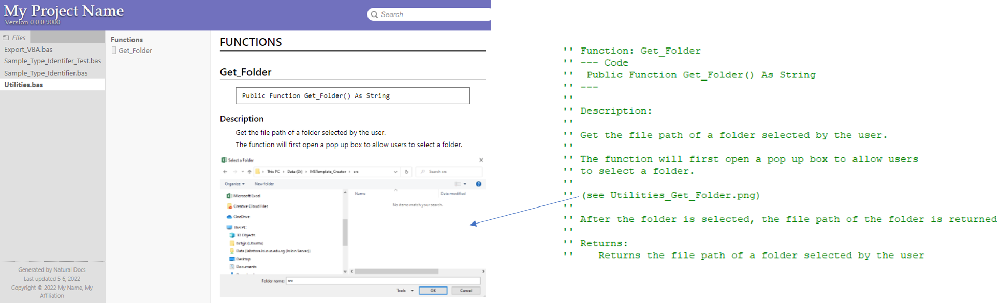
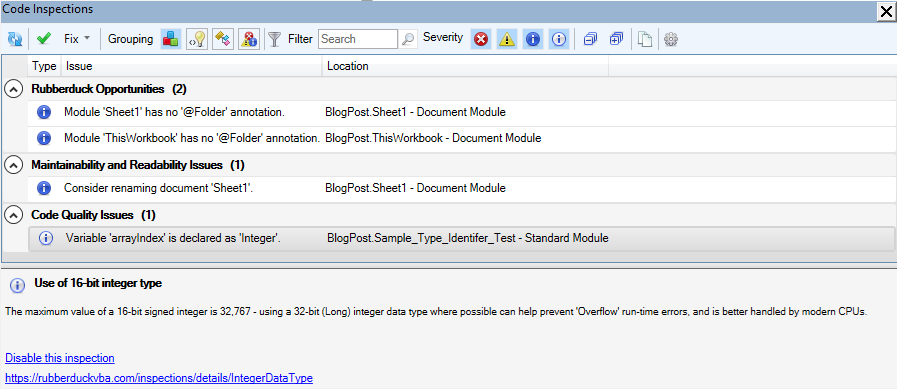

```{r setup, echo=FALSE}
knitr::opts_chunk$set(fig.align = "center")

htmltools::tagList(
  xaringanExtra::use_clipboard(
    button_text = "<i class=\"fa fa-clipboard\"></i> Copy Code",
    success_text = "<i class=\"fa fa-check\" style=\"color: #90BE6D\"></i> Copied!",
  ),
  rmarkdown::html_dependency_font_awesome()
)
```

## Introduction

Finding resources to learn and write VBA code in Excel is relatively simple. [Guru99](https://www.guru99.com/vba-tutorial.html) and [DevTut](https://devtut.github.io/excelvba/) are good places to start.

As I have gotten more familiar with the programming, I then started to look at best code practices for VBA code in Excel. Here are some web resources that was helpful to me:

-   Corporate Finance Institute's [Tips for Writing VBA in Excel](https://corporatefinanceinstitute.com/resources/excel/study/tips-for-writing-vba-in-excel/)
-   Corporate Finance Institute's [Types of Errors in VBA for Excel](https://corporatefinanceinstitute.com/resources/excel/study/types-of-errors-in-vba-for-excel/)
-   DevTut's chapter on [VBA Best Practices](https://devtut.github.io/excelvba/vba-best-practices.html)

With the knowledge gained, I have managed to created a workable Excel macro file called [MSTemplate_Creator](https://github.com/SLINGhub/MSTemplate_Creator) to help researchers create annotation sheets and templates from data exported directly from mass spectrometry software.

When it comes to making it open source, maintainable and contributor friendly, I was faced with several major setbacks which make it hard to achieve these objectives. Resources to help meet these objectives, turn out to be [limited](https://www.excelforum.com/excel-programming-vba-macros/862789-good-coding-sustainable-projects-how-to.html#post2943927)

The first one is that I have no idea how to export the VBA code in Excel as text files so that I can use version control via [git](https://git-scm.com/) and display them on [GitHub](https://github.com/)

The second one is that I have no clue how to create unit tests in VBA code in Excel. This makes the Excel macro file vulnerable to coding related bugs when changes are made to the VBA code. As the number of features increase and more codes are written, it starts to get hard to manage and maintain.

Another barrier is writing good code documentation for a function in Excel VBA code. Code documentation is important for other people to understand your code and build upon it. It is essential for making a software contributor friendly. The University of California, Berkeley Library's [blog post](https://guides.lib.berkeley.edu/how-to-write-good-documentation) provides a wealth of information on which tools can be used in programming languages like Python and R. 

For someone who knows how to create code documentation in R using [Roxygen2](https://roxygen2.r-lib.org/articles/rd.html) and display them online using [pkgdown](https://pkgdown.r-lib.org/), it will be very nice if I am able to do the same thing for Excel VBA. From this [issue post](https://github.com/rubberduck-vba/Rubberduck/issues/5017), I am indeed not the first who wanted this feature for VBA code in Excel.

The key for me to resolve these issues is to use [Rubberduck](https://rubberduckvba.com/) and [Natural Docs](https://www.naturaldocs.org/). I tries to provide a step-by-step to help users adapt to these good practices easily rather than just plain trial and error. 

Source codes can be found at the end of this blog. 

I also have placed a small example in this Github [page](https://github.com/JauntyJJS/Write_Better_Excel_VBA_Project_Example).


## Installation

### Rubberduck VBA installation

Go to the Rubberduck [web page](https://rubberduckvba.com/) to download the installer and install the program.

Check if Rubberduck VBA is successfully installed, open Microsoft Visual Basic for Applications from the Developer Tab and you should see the Rubberduck option.


Here is the [link](https://rubberduckvba.wordpress.com/?s=VBA+Rubberducking) to some blog posts from Rubberduck that showcase its features. In this blog, I will just cover some of them.

### Natural Docs installation

Go to Natural Docs download [web page](https://www.naturaldocs.org/download/) to download the installer and install the program.

If you encounter this in Windows 10 during installation,


Follow the instructions provided in this [web page](https://www.thewindowsclub.com/microsoft-defender-smartscreen-prevented-an-unrecognized-app-from-starting), by right clicking on the installation file and go to Properties.


Check the box Unblock and click Apply, then Ok.


The setup wizard should appear when the installer file is double clicked.


A successful installation should look like this


## Version control

There are a few resources that has been developed to allow version control for Excel. Here are a few that I am aware of:

-   [SheetGit](http://spreadsheetsunl.github.io/sheetgit/)
-   [XLTools](https://xltools.net/)
-   [xltrail](https://www.xltrail.com/)

SheetGit is an add-in for Excel to track spreadsheets but it is unable to track VBA codes in Excel. On the other hand, while XLTools and xltrail does track VBA codes in Excel, it may not be suited for academia labs with limited financial resources to afford commercial software.

### Export VBA code (using Source Code)

Thankfully, Steve Jansen has provided [VBA codes](https://gist.github.com/steve-jansen/7589478) to export VBA code in Excel to text file. I have modified the code such that it does not use the status bar `Application.StatusBar` and file system object `fso`. The modified `Export_Visual_Basic_Code` function can be found in the `Export_VBA` module


With regards to modifying the code to not use `Application.StatusBar`, I just replace it with a much simpler message box using `MsgBox`.


As for the use of `fso` to check if a folder exists and create a folder automatically, I replace it with a function `Get_Folder` from this stack overflow's [post](https://www.mrexcel.com/board/threads/browse-for-a-folder-in-vba.294728/) that creates a dialog box for users to select a folder to save the files. I have placed the `Get_Folder` function in the `Utilities` module


and in the `Export_Visual_Basic_Code`, I call it using `Utilities.Get_Folder`


With the implementation complete, I now run the `Export_Visual_Basic_Code` using the Run Sub button. Ensure that the cursor is located somewhere **inside** the macro function `Export_Visual_Basic_Code` before clicking this button, else the macro will not run.


The below GIF image shows how the process should look like.


One downside of running this code is that files will be overwritten without giving a warning. Nevertheless, being able to export VBA code in Excel is good enough for me and hopefully for you as well.

With the VBA codes exported as text files, we can track it using [git](https://git-scm.com/) and display them on [GitHub](https://github.com/). For me, I use [RStudio IDE](https://www.rstudio.com/products/rstudio/download/) to run git and submit my codes to GitHub

### Export VBA code (using Rubberduck VBA)

Alternatively, we can use Rubberduck VBA to export the files.


However, unlike the first method, this method exports the Microsoft Excel Objects as `.doccls` instead of `.cls` files.


Do note also that empty modules are skipped as well.


### Import VBA code (using Rubberduck VBA)

The [Rubberduck VBA team](https://github.com/rubberduck-vba/Rubberduck/issues/5981) is kind enough to share [some ways to import](https://rubberduckvba.wordpress.com/2020/12/11/sync-project-with-files/) Excel VBA files back into a new Excel file.

Here is what I have learnt.

One method is using a drag and drop approach. This should works with the Module files in `.bas` and Form files in `.frm`.


The downside of this method is that reimporting the same files again will give additional modules with a numerical suffix


On the other hand, we can use Code Explorer Sync Project's command "Update Components from Files". This should works with the Module files in `.bas` and Form files in `.frm`. For the `.doccls` files, ensure that properties name is the same as the `.doccls` file name.


Here is a simple demonstration.


### MSTemplate_Creator example

Here is the `MSTemplate_Creator` exported source code [example](https://github.com/SLINGhub/MSTemplate_Creator/tree/main/src) in Github

## Unit testing

Unit testing is crucial to ensure that the program remains functional when codes are extended or refactored. For Excel VBA in Excel, we can use [Rubberduck VBA](https://rubberduckvba.com/) to create a fully integrated test environment.

Here are the links to learn how to create unit tests using Rubberduck VBA

-   Benard's blog titled: [Learn Excel VBA Unit Testing](https://www.bernardvukas.com/testing/tutorial-excel-vba-unit-testing/)
-   Rubberduck VBA's blog titled: [How to unit test VBA code?](https://rubberduckvba.wordpress.com/2017/10/19/how-to-unit-test-vba-code/)
-   Rubberduck VBA's blog titled: [Code Insights with Rubberduck + Excel](https://rubberduckvba.wordpress.com/2019/01/05/code-insights-with-rubberduck-excel/)
-   Rubberduck VBA's Github Wiki page titled: [Unit Testing](https://github.com/rubberduck-vba/Rubberduck/wiki/Unit-Testing)

### Rubberduck VBA initialisation

I understand that using Rubberduck VBA may be complicated for some, hence, here is a step by step process. Ensure that the VBA code is **free from syntax error/bugs**.

To display the Rubberduck VBA toolbar, go to the toolbar options, "Add or Remove Buttons" and then click on "Customize".


You will see the "Customize" box. Check the box beside "Rubberduck" and you will see the Rubberduck VBA toolbar being displayed. Click close.


However, it is possible that Rubberduck is not initialised and all the options may be masked.


To initialise it, click on "Pending" at the Rubberduck VBA toolbar


When it appears as “Ready”, you can start the Rubberduck VBA tools like unit testing


If it appears like this, it means you have a syntax error (Should be “Dim FileThere” instead of “DimFileThere”) and Rubberduck VBA clearly cannot proceed with unit testing on codes with bugs.


### Function example

We now create a function and a unit test to show how it works

Firstly, we need to ensure some Excel VBA references are used. To open the reference box, go to Tools and then References


Ensure that the following Excel VBA reference list are checked, especially Microsoft VBScript Regular Expression 5.5 as our function to test involves the use of regular expression.


The function we are using to create the unit test is called `Is_EQC` and is created in the `Sample_Type_Identifier` module. What the `Is_EQC` function does is to give a boolean True if the input string contains the word "EQC", "Eqc" or "eqc".


A good summary of how to do regular expression in VBA code in Excel can be found in this [stackoverflow question](https://stackoverflow.com/questions/22542834/how-to-use-regular-expressions-regex-in-microsoft-excel-both-in-cell-and-loops)
### Adding a new unit test module

Now to test the function we create a unit test using Rubberduck VBA.

To start the unit testing, click on Rubberduck, Unit tests and then Test Explorer.


This will open up the Test Explorer table. To create a simple test module click on Add and then Test Module


You may refer to the resources that I have provided earlier to see how to write a unit test properly. 

### Unit test function example

The unit test function for this example is called `Is_EQC_Test` and is created in the `Sample_Type_Identifier_Test` module. It provides the `Is_EQC` function created with some test input string from `EQCTestArray` and test if the output is True.


Click on the refresh button to update the Test Explorer to find any newly created unit test


If the above example is used, the test explorer table should look like this


To run all the unit test, Click on Run, then all test


A few message boxes will pop up. Just click Ok. When it is done, it should look like this. 


### MSTemplate_Creator example

Here is the `MSTemplate_Creator` unit test example


In addition, I also created a function that does an integration test as well.


## Code documenation

After some online searching and trial and errors, I managed to create the code documentation using [Natural Docs](https://www.naturaldocs.org/). Here is how I do it in Windows 10.

### Natural Docs configuration set up

Referring to the instruction provided in the Natural Docs Getting Started [web page](https://www.naturaldocs.org/getting_started/)

First, create a folder that will contain configuration files for Natural Docs. In the example below, an empty folder called `naturaldocs_config` in the project folder `Excel_VBA_Project_Example`


Next, go to the folder where Natural Docs is installed and create a shortcut to the Natural Docs.exe file.


The shortcut should be created in the Desktop. Move the shortcut file in the project folder.


Open the shortcut properties.


In the Target section, fill in the command lines.

`"C:\Program Files (x86)\Natural Docs\NaturalDocs.exe" naturaldocs_config --pause-before-exit`

Or

`{Pathway to NaturalDocs exe file} {Pathway to Configuration folder} -- pause-before-exit`

In the Start in section, fill in the file path where the project folder is


Double clicking on the shortcut exe file will give the following.


Three configuration file should be created.


Create an empty folder called `docs` in the project folder `Excel_VBA_Project_Example`. This is where the Natural Docs will output the code documentation.


Now it is time to edit the configuration files to tell Natural Docs some critical information for it to run properly.

The references of each configuration file can be found as follows:

-   [Project.txt](https://www.naturaldocs.org/reference/project.txt/)
-   [Languages.txt](https://www.naturaldocs.org/reference/languages.txt/)
-   [Comments.txt](hhttps://www.naturaldocs.org/reference/comments.txt/)

In this project example, I have made to following important changes.

In `Project.txt`, I have stated the title, subtitle, copyright, source folder in which Natural Docs will look for input files, image folder in which Natural Docs will look to get the image file to link in the code documentation, HTML Output folder in which Natural Docs will output the code documentation files.

<pre style="height: 300px; overflow: scroll;">
Format: 2.2

# This is the main file you use to configure Natural Docs for your project.


# Project Information
# ------------------------------------------------------------------------

Title: My Project Name
Subtitle: Version 0.0.0.9000

Copyright: Copyright © 2022 My Name, My Affiliation

Timestamp: Last updated 5 6, 2022

# Source Code
# ------------------------------------------------------------------------

Source Folder: ..\src
   Name: My Project Name
   
# Images
# ------------------------------------------------------------------------

Image Folder: ..\figures\code_documentation

# Generated Documentation
# ------------------------------------------------------------------------

HTML Output Folder: ..\docs
</pre>

In `Languages.txt`, I have stated the programming language name, the line comment symbol to tell Natural Docs which part of the excel VBA file is the code documentation, the excel VBA line extender symbol and indicate that excel VBA is case sensitive.

While `'` is the actual line comment symbol for excel VBA, we use `''` instead to represent code documentation to differentiate between general comments and `'@` used by Rubberduck.

```r
# Languages
# ------------------------------------------------------------------------
# The syntax reference is after the definitions.

Language: Excel VBA

   Line Comment: ''
   Line Extender: _
   Case Sensitive: Yes
```

No modification is made in `Comments.txt`

### Code documentation execution

From our configuration settings, we are telling Natural Docs to read the files in the `src` folder


Look for those lines that starts with `''`


Read Images in the  `figures\code_documentation` folder


And build the documentation in the `docs` folder


With the parameters set, double clicking on the shortcut exe file


will give the following pop up command line


This will create the following


Clicking on `index.html` will give the following


### Code documentation explanation

Take a look at Natural Docs [formatting web page](https://www.naturaldocs.org/reference/formatting/) for more details on how to write the code documentation correctly.

For our examples used, I have provided some arrows to show where are things coming from.

Use of Paragraphs, Headings, Definition List and Code Diagram example


Use of Bullet Lists example


Use of Images example


### Comment Block in Edit toolbar

To write code documentation easily, it will be nice to be able to comment a block of code. Microsoft Visual Basic for Application also have this functionality. It is just hidden. Check out Paul Murana's [blog post](https://www.tachytelic.net/2018/11/how-to-comment-a-block-of-code-in-the-microsoft-office-vba-editor/) to see how to find it.

### Deploy using Github Pages.

Now that we have a docs folder with a working code documentation (`index.html`), we can push all the files to Github. For me, I made the code documentation public using [Github Pages](https://pages.github.com/).

I understand that there are more advanced and better way to do create code documentation webpages but this is the best that I can come up with so far.


### MSTemplate_Creator example

Here is the link to the `MSTemplate_Creator` code documentation [example](https://slinghub.github.io/MSTemplate_Creator/)

## Code Explorer

In Microsoft Visual Basic for Application, code files are grouped by default accordingly by Microsoft Excel Object, Modules and Forms.

If you are unaware, Rubberduck VBA actually have a [code explorer](https://rubberduckvba.wordpress.com/using-rubberduck/code-explorer/) functionality to help users customised how Microsoft Excel Object, Modules and Forms files be grouped and organised together.


Here is an example


## Code Inspection

Rubberduck VBA also have a [code inspection](https://github.com/rubberduck-vba/Rubberduck/wiki/Code-Inspections) feature that encourage users write better excel VBA code like giving better variable names, always use `Option Explicit` and so on.


Here is an example


## Conclusion

I have to admit that there is a lot of new knowledge in this blog and it does make my brain go 😵. Nevertheless, I do hope the blog may be useful for someone who wants to improve their Excel VBA code and to make it more open source, maintainable and contributor friendly. Just take things slow and don't give up.

For reference, here is the Github page for [MSTemplate_Creator](https://github.com/SLINGhub/MSTemplate_Creator)

Here is the Github [page](https://github.com/JauntyJJS/Write_Better_Excel_VBA_Project_Example) for the small example.


Here are the VBA codes for all the modules and the Natural Docs configuration code used for the small example.



<pre style="height: 300px; overflow: scroll;">
Option Explicit
'@Folder("Export VBA Source Code Functions")
'@IgnoreModule IntegerDataType

'' Function: Export_Visual_Basic_Code
''
'' Description:
''
'' Export all VBA source codes to a user selected folder.
''
'' The function will first open a pop up box to allow users
'' to select a folder.
''
'' (see Utilities_Get_Folder.png)
''
'' After the folder is selected, the VBA source codes
'' will be exported to that folder.
''
'' (see Export_VBA_Output.png)
''
'' Do note that files will be overwritten without warning.
''
Public Sub Export_Visual_Basic_Code()
    'https://gist.github.com/steve-jansen/7589478
    Const Module As Integer = 1
    Const ClassModule As Integer = 2
    Const Form As Integer = 3
    Const Document As Integer = 100
    'Const Padding As Integer = 24
    
    Dim VBComponent As Object
    Dim Count As Integer
    Dim Path As String
    Dim Directory As String
    Dim Extension As String
    
    ' Folder must exist prior to outputting the source file
    Directory = Utilities.Get_Folder()
    If Directory = vbNullString Then
        Exit Sub
    End If
    
    Count = 0
    
    For Each VBComponent In ActiveWorkbook.VBProject.VBComponents
        Select Case VBComponent.Type
            Case ClassModule, Document
                Extension = ".cls"
            Case Form
                Extension = ".frm"
            Case Module
                Extension = ".bas"
            Case Else
                Extension = ".txt"
        End Select
            
                
        On Error Resume Next
        Err.Clear
        
        Path = Directory & "\" & VBComponent.Name & Extension
        VBComponent.Export Path
        
        If Err.Number <> 0 Then
            MsgBox "Failed to export " & VBComponent.Name & " to " & Path, vbCritical
        Else
            Count = Count + 1
            'Debug.Print "Exported " & Left$(VBComponent.Name & ":" & Space(Padding), Padding) & path
        End If

        On Error GoTo 0
    Next
    
    MsgBox "Successfully exported " & CStr(Count) & " VBA files to " & Directory

End Sub
</pre>


<pre style="height: 300px; overflow: scroll;">
Option Explicit
'@Folder("Utilities Functions")

'' Function: Get_Folder
''
'' Description:
''
'' Get the file path of a folder selected by the user.
''
'' The function will first open a pop up box to allow users
'' to select a folder.
''
'' (see Utilities_Get_Folder.png)
''
'' After the folder is selected, the file path of the folder is returned
''
'' Returns:
''    Returns the file path of a folder selected by the user
Public Function Get_Folder() As String
    'https://stackoverflow.com/questions/26392482/vba-excel-to-prompt-user-response-to-select-folder-and-return-the-path-as-string
    Dim Folder As FileDialog
    Dim Selected_Item As String
    Set Folder = Application.FileDialog(msoFileDialogFolderPicker)
    With Folder
        .Title = "Select a Folder"
        .AllowMultiSelect = False
        .InitialFileName = Application.DefaultFilePath
        If .Show <> -1 Then GoTo NextCode
        Selected_Item = .SelectedItems.Item(1)
    End With
NextCode:
    Get_Folder = Selected_Item
    Set Folder = Nothing
End Function

</pre>


<pre style="height: 300px; overflow: scroll;">
Option Explicit

'@Folder("QC_Sample_Type_Identification")

'' Function: Is_EQC
''
'' Description:
''
'' Check is the input string (sample name) is an EQC.
''
'' Parameters:
''
''    FileName - Input string to check if it is an EQC
''
'' Returns:
''    A boolean (True or False). Return True if
''    the input string contains "EQC", "Eqc", "eqc"
''
'' Examples:
''
'' --- Code
''    Dim EQCTestArray As Variant
''    Dim arrayIndex As Integer
''
''    EQCTestArray = Array("EQC", "001_EQC_TQC prerun 01")
''
''    For arrayIndex = 0 To UBound(EQCTestArray) - LBound(EQCTestArray)
''        Debug.Print Sample_Type_Identifier.Is_EQC(CStr(EQCTestArray(arrayIndex))) & ": " & _
''                    EQCTestArray(arrayIndex)
''    Next
'' ---
Public Function Is_EQC(ByVal FileName As String) As Boolean
    Dim NonLettersRegEx As RegExp
    Set NonLettersRegEx = New RegExp
    Dim EQCRegEx As RegExp
    Set EQCRegEx = New RegExp
    Dim OnlyLettersText As String
    NonLettersRegEx.Pattern = "[^A-Za-z]"
    NonLettersRegEx.Global = True
    
    EQCRegEx.Pattern = "(EQC|[Ee]qc)"
    OnlyLettersText = Trim$(NonLettersRegEx.Replace(FileName, " "))
    Is_EQC = EQCRegEx.Test(OnlyLettersText)
    
End Function
</pre>


<pre style="height: 300px; overflow: scroll;">
Option Explicit
Option Private Module

'@TestModule
'@Folder("Tests")

Private Assert As Object
'Private Fakes As Object

'@ModuleInitialize
Public Sub ModuleInitialize()
    'this method runs once per module.
    Set Assert = CreateObject("Rubberduck.AssertClass")
    'Set Fakes = CreateObject("Rubberduck.FakesProvider")
End Sub

'@ModuleCleanup
Public Sub ModuleCleanup()
    'this method runs once per module.
    Set Assert = Nothing
    'Set Fakes = Nothing
End Sub

'@TestMethod("Get QC Sample Type")

'' Function: Is_EQC_Test
''
'' Description:
''
'' Function used to test if the function
'' Sample_Type_Identifier.Is_EQC is working
''
'' Test data are
''
''  - A string array EQCTestArray
''
'' Function will assert if Sample_Type_Identifier.Is_EQC gives
'' True to all entries in EQCTestArray
''
Public Sub Is_EQC_Test()
    On Error GoTo TestFail
    
    Dim EQCTestArray As Variant
    Dim arrayIndex As Integer
    
    EQCTestArray = Array("EQC", "001_EQC_TQC prerun 01")
           
    For arrayIndex = 0 To UBound(EQCTestArray) - LBound(EQCTestArray)
        'Debug.Print Sample_Type_Identifier.Is_EQC(CStr(EQCTestArray(arrayIndex))) & ": " & _
                     EQCTestArray(arrayIndex)
        MsgBox Sample_Type_Identifier.Is_EQC(CStr(EQCTestArray(arrayIndex))) & ": " & _
                     EQCTestArray(arrayIndex)
        Assert.IsTrue (Sample_Type_Identifier.Is_EQC(CStr(EQCTestArray(arrayIndex))))
    Next

    GoTo TestExit
TestExit:
    Exit Sub
TestFail:
    Assert.Fail "Test raised an error: #" & Err.Number & " - " & Err.Description
End Sub
</pre>


<pre style="height: 300px; overflow: scroll;">
Format: 2.2

# This is the main file you use to configure Natural Docs for your project.


# Project Information
# ------------------------------------------------------------------------

Title: My Project Name
Subtitle: Version 0.0.0.9000

Copyright: Copyright © 2022 My Name, My Affiliation

Timestamp: Last updated 5 6, 2022
#    m     - Single digit month, when possible.  January is "1".
#    mm    - Always double digit month.  January is "01".
#    mon   - Short month word.  January is "Jan".
#    month - Long month word.  January is "January".
#    d     - Single digit day, when possible.  1 is "1".
#    dd    - Always double digit day.  1 is "01".
#    day   - Day with text extension.  1 is "1st".
#    yy    - Double digit year.  2022 is "22".
#    yyyy  - Four digit year.  2022 is "2022".
#    year  - Four digit year.  2022 is "2022".


# This is where you put general information about your project.  None of these
# settings are required, though Title is recommended.
#
# Title: [text]
#    The name of your project.  (R) and (TM) will be converted to their
#    respective symbols.
#
# Subtitle: [text]
#    A subtitle for your project, if desired.
#
# Copyright: [text]
#    The copyright notice for your project.  (C) will be converted to the
#    copyright symbol.
#
# Timestamp: [text]
#    Text explaining when the documentation was generated, such as "Last
#    Updated Month Day Year", if you want that to be included.  The following
#    substitutions are performed:
#
#    m     - Single digit month, when possible.  January is "1".
#    mm    - Always double digit month.  January is "01".
#    mon   - Short month word.  January is "Jan".
#    month - Long month word.  January is "January".
#    d     - Single digit day, when possible.  1 is "1".
#    dd    - Always double digit day.  1 is "01".
#    day   - Day with text extension.  1 is "1st".
#    yy    - Double digit year.  2022 is "22".
#    yyyy  - Four digit year.  2022 is "2022".
#    year  - Four digit year.  2022 is "2022".
#
# Style: [style]
#    A custom style to apply to the generated documentation.  See
#    https://naturaldocs.org/reference/styles for more information.
#
# Home Page: [file]
#    A custom home page for the generated documentation.  It could be a
#    documented file in one of the source folders or a HTML file in any
#    location.
#
# Encoding: [name or code page number]
# Encoding: [name or code page number] *.[extension]
#    The character encoding source files use if it is something other than
#    Unicode.  It can be specified as a name such as "iso-8859-1" or a code
#    page number such as "28591".  You can see the list of encodings your
#    system supports by running Natural Docs with the --list-encodings command
#    line option.
#
#    Natural Docs defaults to Unicode which will handle all forms of UTF-8,
#    UTF-16, and UTF-32.  You can set a new default for all files or you can
#    limit it to an extension such as "*.txt".  You can use multiple Encoding
#    lines to cover all the extensions that need them.
#
#    You can also set encodings for specific folders by adding Encoding lines
#    in Source Folder sections.


# Source Code
# ------------------------------------------------------------------------

Source Folder: ..\src
   Name: My Project Name


# This is where you tell Natural Docs which folders it should scan for source
# files.  If you add any on the command line this section is ignored except
# for the properties of the ones from the command line.
#
# Source Folder: [folder]
#    Specifies a folder which will be searched for source files.  The path is
#    relative to the project configuration folder, which lets this file remain
#    portable across computers and not cause problems in version control
#    systems.  You can enter an absolute path and it will be converted
#    automatically.
#
#    Additional properties can be added after each source folder:
#
#    Name: [name]
#       How this source folder will appear in the menu if you have more than
#       one.
#
#    Encoding: [name or code page number]
#    Encoding: [name or code page number] *.[extension]
#    Encoding: [name or code page number] [folder]
#    Encoding: [name or code page number] [folder]\*.[extension]
#       The character encoding source files use if it's something other than
#       Unicode.  It can be specified as a name such as "iso-8859-1" or a code
#       page number such as "28591".  You can see the list of encodings your
#       system supports by running Natural Docs with the --list-encodings
#       command line option.
#
#       Natural Docs defaults to Unicode which will handle all forms of UTF-8,
#       UTF-16, and UTF-32.  You can set a new default for all files in this
#       folder, limit it to an extension such as "*.txt", limit it to a
#       subfolder, or limit it to extensions in a subfolder.  You can use
#       multiple Encoding lines to cover all the subfolders and extensions
#       that need them.


# Source Filtering
# ------------------------------------------------------------------------

# If there are any subfolders in the source code that you would like Natural
# Docs to ignore they can be added here.  If you use any of these options on
# the command line this section is ignored.
#
# Ignore Source Folder: [folder]
#    Tells Natural Docs to skip this folder when scanning files.
#
# Ignore Source Folder Pattern: [pattern]
#    Tells Natural Docs to skip all folder names which match this pattern when
#    scanning files.  ? matches a single character, * matches zero or more
#    characters.  It applies to the entire folder name, so "cli" will not
#    match "client", although "cli*" will.
#
#    The data folders of common version control systems (.git, .svn, .cvs, .hg)
#    are ignored automatically.  You don't have to add them here.


# Images
# ------------------------------------------------------------------------

Image Folder: ..\figures\code_documentation


# This is where you tell Natural Docs which folders it should look for images
# in.  When you put something like (see diagram.jpg) in a comment Natural Docs
# will look for it relative to the source file it appears in plus any folders
# added here.  If you add any on the command line this section is ignored.
#
# Image Folder: [folder]
#    Specifies a folder which will be searched for image files.  The path is
#    relative to the project configuration folder, which lets this file remain
#    portable across computers and not cause problems in version control
#    systems.  You can enter absolute paths and they will be converted
#    automatically.


# Generated Documentation
# ------------------------------------------------------------------------

HTML Output Folder: ..\docs


# This is where you tell Natural Docs what kind of documentation you want
# built and where it should be put.  If you use any of these options on the
# command line this section is ignored except for the properties of the ones
# from the command line.
#
# HTML Output Folder: [folder]
#    Generates HTML documentation in the specified folder.  The path is
#    relative to the project configuration folder, which lets this file remain
#    portable across computers and not cause problems in version control
#    systems.  You can enter an absolute path and it will be converted
#    automatically.
#
#    Additional properties can be added after each output folder:
#
#    Title: [text]
#    Subtitle: [text]
#    Copyright: [text]
#    Timestamp: [text]
#    Style: [style]
#    Home Page: [file]
#       These properties can be overridden for just this output folder, which
#       allows you to have multiple output folders with different styles or
#       titles.  See the Project Information section for descriptions of them.


# Global Settings
# ------------------------------------------------------------------------

# Other settings that apply to your entire project.  Settings specified on the
# command line override the settings here.
#
# Tab Width: [width]
#    The number of spaces tabs should be expanded to.
#
# Documented Only: [yes|no]
#    Whether only documented code elements should appear in the output.
#    Defaults to no.
#
# Auto Group: [yes|no]
#    Whether groups should automatically apply to you code.  Defaults to yes.
</pre>


<pre style="height: 300px; overflow: scroll;">
Format: 2.2

# This is the Natural Docs languages file for this project.  If you change
# anything here, it will apply to THIS PROJECT ONLY.  You can edit the version
# in Natural Docs' Config folder to make the changes apply to all projects,
# but it's recommended that you edit this version instead.


# Ignored Extensions
# ------------------------------------------------------------------------

# If you'd like to prevent certain file extensions from being scanned by
# Natural Docs, you can do it like this:
#
# Ignore Extensions: [extension] [extension] ...


# Languages
# ------------------------------------------------------------------------
# The syntax reference is after the definitions.

Language: Excel VBA

   Line Comment: ''
   Line Extender: _
   Case Sensitive: Yes


# These settings define the languages Natural Docs knows how to parse.  You
# can define your own here or override the settings of the existing ones.
# Note that all lists are space separated so that commas can be used as
# values.
#
# Language: [name]
# Alter Language: [name]
#    Defines a new language or alters an existing one.  Its name can use any
#    characters.  If any of the properties below have an add/replace form, you
#    must use that when using Alter Language.
#
#    The language Shebang Script is special.  It's entry is only used for
#    extensions, and files with those extensions have their shebang (#!) lines
#    read to determine the real language of the file.  Extensionless files are
#    always treated this way.
#
#    The language Text File is also special.  It's treated as one big comment
#    so you can put Natural Docs content in them without special symbols.
#
# Extensions: [extension] [extension] ...
# [Add/Replace] Extensions: [extension] [extension] ...
#    Defines the file extensions of the language's source files.
#
# Shebang Strings: [string] [string] ...
# [Add/Replace] Shebang Strings: [string] [string] ...
#    Defines a list of strings that can appear in the shebang (#!) line to
#    designate that it's part of the language.
#
# Simple Identifier: [name]
#    The name of the language using only the letters A to Z.  No spaces,
#    numbers, symbols, or Unicode allowed.  Defaults to the language name
#    minus any unacceptable characters.  This is used to generate things like
#    CSS class names.
#
# Aliases: [alias] [alias] ...
# [Add/Replace] Aliases: [alias] [alias] ...
#    Defines alternative names for the language that can be used to start a
#    code block.
#
#
# Properties for Basic Language Support Only
# ------------------------------------------------------------------------
# If you're adding your own language to Natural Docs you must define these.
#
# Line Comments: [symbol] [symbol] ...
#    Defines a space-separated list of symbols that are used for line comments,
#    if any.
#
# Block Comments: [opening sym] [closing sym] [opening sym] [closing sym] ...
#    Defines a space-separated list of symbol pairs that are used for block
#    comments, if any.
#
# Member Operator: [symbol]
#    Defines the default member operator symbol.  The default is a dot.
#
# Line Extender: [symbol]
#    Defines the symbol that allows a prototype to span multiple lines if
#    normally a line break would end it.
#
# Enum Values: [global|under type|under parent]
#    Defines how enum values are referenced.  The default is global.
#    global       - Values are always global, referenced as 'value'.
#    under type   - Values are under the enum type, referenced as
#                   'class.enum.value'.
#    under parent - Values are under the enum's parent, referenced as
#                   'class.value'.
#
# Case Sensitive: [yes|no]
#    Defines whether the language's identifiers are case sensitive.  The
#    default is yes.
#
# [Comment Type] Prototype Enders: [symbol] [symbol] ...
#    When defined, Natural Docs will attempt to get a prototype from the code
#    immediately following the comment type.  It stops when it reaches one of
#    these symbols.  Use \n for line breaks.
</pre>


