<script src="index_files/clipboard/clipboard.min.js"></script>
<link href="index_files/xaringanExtra-clipboard/xaringanExtra-clipboard.css" rel="stylesheet" />
<script src="index_files/xaringanExtra-clipboard/xaringanExtra-clipboard.js"></script>
<script>window.xaringanExtraClipboard(null, {"button":"<i class=\"fa fa-clipboard\"><\/i> Copy Code","success":"<i class=\"fa fa-check\" style=\"color: #90BE6D\"><\/i> Copied!","error":"Press Ctrl+C to Copy"})</script>
<link href="index_files/font-awesome/css/all.css" rel="stylesheet" />
<link href="index_files/font-awesome/css/v4-shims.css" rel="stylesheet" />


## Short summary

There are many good resources on how to write good VBA code for Excel. However, during my experiences in working on VBA code in Excel, I realise some issues that makes it hard for such code to be open source, maintainable and contributor friendly. Nevertheless, I have managed to find alternative ways to tackle these problems. Hope that my suggestions may be useful for you.

## Introduction

Finding resources to learn and write VBA code in Excel is relatively simple. [Guru99](https://www.guru99.com/vba-tutorial.html) and [DevTut](https://devtut.github.io/excelvba/) are good places to start.

As I have gotten more familiar with the programming, I then started to look at best code practices for VBA code in Excel. Here are some web resources that was helpful to me:

-   Corporate Finance Institute's [Tips for Writing VBA in Excel](https://corporatefinanceinstitute.com/resources/excel/study/tips-for-writing-vba-in-excel/)
-   Corporate Finance Institute's [Types of Errors in VBA for Excel](https://corporatefinanceinstitute.com/resources/excel/study/types-of-errors-in-vba-for-excel/)
-   DevTut's chapter on [VBA Best Practices](https://devtut.github.io/excelvba/vba-best-practices.html)

With the knowledge gained, I have managed to created a workable Excel macro file called [MSTemplate_Creator](https://github.com/SLINGhub/MSTemplate_Creator) to help researchers create annotation sheets and templates from data exported directly from mass spectrometry software.

When it comes to making it open source, maintainable and contributor friendly, I was faced with several major setbacks which makes it hard to achieve these objectives. Resources to help meet these objectives, turn out to be [limited](https://www.excelforum.com/excel-programming-vba-macros/862789-good-coding-sustainable-projects-how-to.html#post2943927)

## The issues

The first one is that I have no idea how to export the VBA code in Excel as text files so that I can use version control via [git](https://git-scm.com/) and display them on [GitHub](https://github.com/)

The second one is that I have no clue how to create unit tests in VBA code in Excel. This makes the Excel macro file vulnerable to coding related bugs when changes are made to the VBA code. As the number of features increase and more codes are written, it starts to get hard to manage and maintain.

Another barrier is writing good code documentation for a function in Excel VBA code. Code documentation is important for other people to understand your code and build upon it. It is essential for making a software contributor friendly. The University of California, Berkeley Library's [blog post](https://guides.lib.berkeley.edu/how-to-write-good-documentation) provides a wealth of information on which tools can be used in programming languages like Python and R. 

For someone who knows how to create code documentation in R using [Roxygen2](https://roxygen2.r-lib.org/articles/rd.html) and display them online using [pkgdown](https://pkgdown.r-lib.org/), it will be very nice if I am able to do the same thing for Excel VBA. From this [issue post](https://github.com/rubberduck-vba/Rubberduck/issues/5017), I am indeed not the first who wanted this feature for VBA code in Excel.

## Version control

### Version control resources 

There are a few resources that has been developed to allow version control for Excel. Here are a few that I am aware of:

-   [SheetGit](http://spreadsheetsunl.github.io/sheetgit/)
-   [XLTools](https://xltools.net/)
-   [xltrail](https://www.xltrail.com/)

SheetGit is an add-in for Excel to track spreadsheets but it is unable to track VBA codes in Excel. On the other hand, while XLTools and xltrail does track VBA codes in Excel, it may not be suited for academia labs with limited financial resources to afford commercial software.

### Export VBA code implementation 

Thankfully, Steve Jansen has provided [VBA codes](https://gist.github.com/steve-jansen/7589478) to export VBA code in Excel to text file. I have modified the code such that it does not use the status bar `Application.StatusBar` and file system object `fso`. The modified `Export_Visual_Basic_Code` function can be found in the `Export_VBA` module


With regards to modifying the code to not use `Application.StatusBar`, I just replace it with a much simpler message box using `MsgBox`.


As for the use of `fso` to check if a folder exists and create a folder automatically, I replace it with a function `Get_Folder` from this stack overflow's [post](https://www.mrexcel.com/board/threads/browse-for-a-folder-in-vba.294728/) that creates a dialog box for users to select a folder to save the files. I have placed the `Get_Folder` function in the `Utilities` module

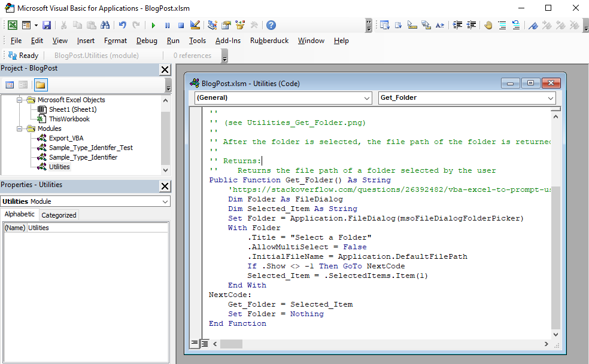

and in the `Export_Visual_Basic_Code`, I call it using `Utilities.Get_Folder`


### Export VBA code execution

With the implementation complete, I now run the `Export_Visual_Basic_Code` using the Run Sub button. Ensure that the cursor is located somewhere **inside** the macro function `Export_Visual_Basic_Code` before clicking this button, else the macro will not run.


The below GIF image shows how the process should look like.

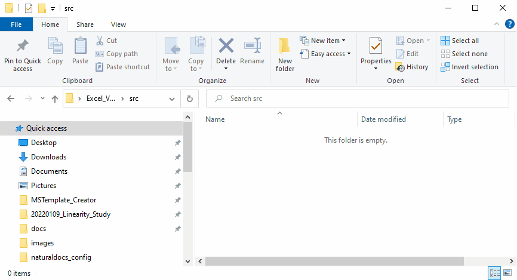

One downside of running this code is that files will be overwritten without giving a warning. Nevertheless, being able to export VBA code in Excel is good enough for me and hopefully for you as well.

With the VBA codes exported as text files, we can track it using [git](https://git-scm.com/) and display them on [GitHub](https://github.com/). For me, I use [RStudio IDE](https://www.rstudio.com/products/rstudio/download/) to run git and submit my codes to GitHub

### MSTemplate_Creator example

Here is the [MSTemplate_Creator example](https://github.com/SLINGhub/MSTemplate_Creator/tree/main/src)

## Unit testing

Unit testing is crucial to ensure that the program remains functional when codes are extended or refactored. For Excel VBA in Excel, we can use [Rubberduck VBA](https://rubberduckvba.com/) to create a fully integrated test environment.

### Getting started with Rubberduck VBA

Here are the links to learn how to create unit tests using Rubberduck VBA

-   Benard's blog titled: [Learn Excel VBA Unit Testing](https://www.bernardvukas.com/testing/tutorial-excel-vba-unit-testing/)
-   Rubberduck VBA's blog titled: [How to unit test VBA code?](https://rubberduckvba.wordpress.com/2017/10/19/how-to-unit-test-vba-code/)
-   Rubberduck VBA's blog titled: [Code Insights with Rubberduck + Excel](https://rubberduckvba.wordpress.com/2019/01/05/code-insights-with-rubberduck-excel/)
-   Rubberduck VBA's Github Wiki page titled: [Unit Testing](https://github.com/rubberduck-vba/Rubberduck/wiki/Unit-Testing)

### Rubberduck VBA initialisation

I understand that using Rubberduck VBA may be complicated for some, hence, here is a step by step process. Ensure that the VBA code is **free from syntax error/bugs**.

Firstly, to check if Rubberduck VBA is successfully installed, open Microsoft Visual Basic for Applications from the Developer Tab and you should see the Rubberduck option.


To display the Rubberduck VBA toolbar, go to the toolbar options, "Add or Remove Buttons" and then click on "Customize".


You will see the "Customize" box. Check the box beside "Rubberduck" and you will see the Rubberduck VBA toolbar being displayed. Click close.

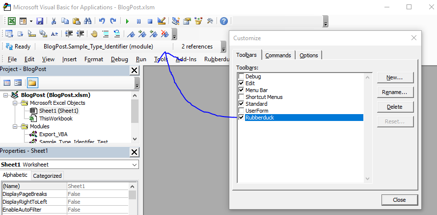

However, it is possible that Rubberduck is not initialised and all the options may be masked.

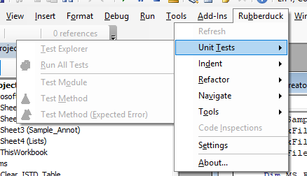

To initialise it, click on "Pending" at the Rubberduck VBA toolbar

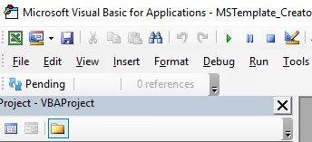

When it appears as “Ready”, you can start the Rubberduck VBA tools like unit testing

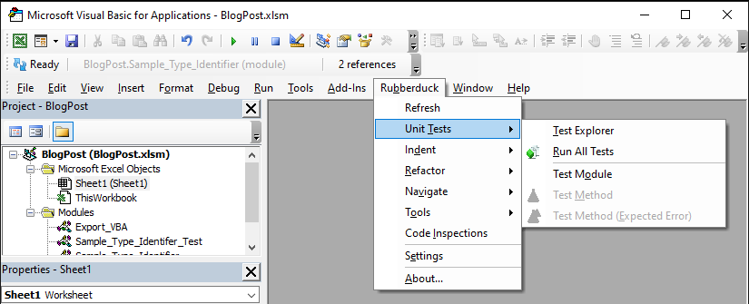
If it appears like this, it means you have a syntax error (Should be “Dim FileThere” instead of “DimFileThere”) and Rubberduck VBA clearly cannot proceed with unit testing on codes with bugs.


### Function example

We now create a function and a unit test to show how it works

Firstly, we need to ensure some Excel VBA references are used. To open the reference box, go to Tools and then References


Ensure that the following Excel VBA reference list are checked, especially Microsoft VBScript Regular Expression 5.5 as our function to test involves the use of regular expression.

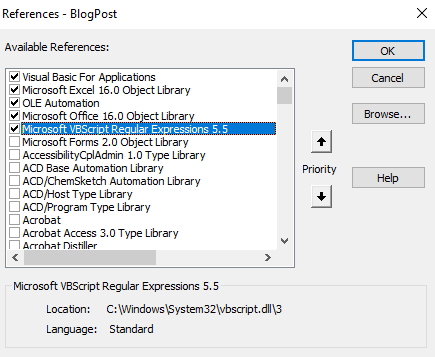

The function we are using to create the unit test is called `Is_EQC` and is created in the `Sample_Type_Identifier` module. What the `Is_EQC` function does is to give a boolean True if the input string contains the word "EQC", "Eqc" or "eqc".


### Adding a new unit test module

Now to test the function we create a unit test using Rubberduck VBA.

To start the unit testing, click on Rubberduck, Unit tests and then Test Explorer.

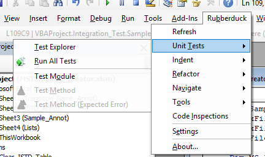
This will open up the Test Explorer table. To create a simple test module click on Add and then Test Module

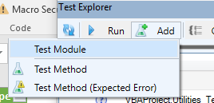


You may refer to the resources that I have provided earlier to see how to write a unit test properly. 

### Unit test function example

The unit test function for this example is called `Is_EQC_Test` and is created in the `Sample_Type_Identifier_Test` module. It provides the `Is_EQC` function created with some test input string from `EQCTestArray` and test if the output is True.

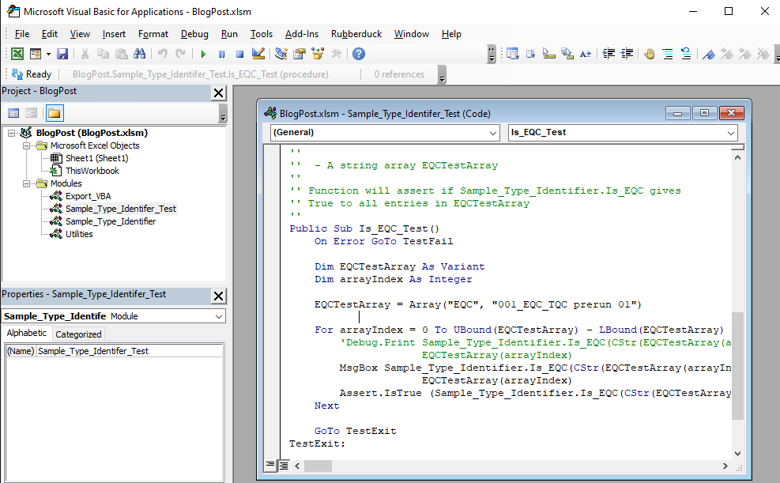

Click on the refresh button to update the Test Explorer to find any newly created unit test


If the above example is used, the test explorer table should look like this


To run all the unit test, Click on Run, then all test

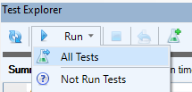

A few message boxes will pop up. Just click Ok. When it is done, it should look like this. 


### MSTemplate_Creator example

Here is the MSTemplate_Creator unit test example


In addition, I also created a function that does an integration test as well.


## Code documenation

After some online searching and trial and errors, I managed to create the code documentation using [Natural Docs](https://www.naturaldocs.org/). Here is how I do it in Windows 10.

### Natural Docs installation

Go to Natural Docs download web page [web page](https://www.naturaldocs.org/download/) to download the installer and install the program.

If you encounter this in Windows 10 during installation,

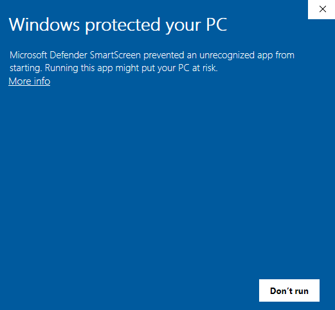

Follow the instructions provided in this [web page](https://www.thewindowsclub.com/microsoft-defender-smartscreen-prevented-an-unrecognized-app-from-starting), by right clicking on the installation file and go to Properties.

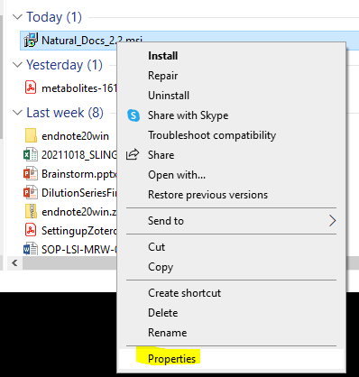
Check the box Unblock and click Apply, then Ok.

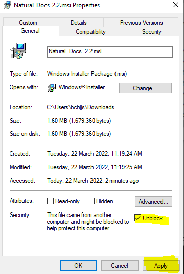
The setup wizard should appear when the installer file is double clicked.


A successful installation should look like this


### Natural Docs setting up

Referring to the instruction provided in the Natural Docs Getting Started [web page](https://www.naturaldocs.org/getting_started/)

First, create a folder that will contain configuration files for Natural Docs. In the example below, an empty folder called `naturaldocs_config` in the project folder `Excel_VBA_Project_Example`

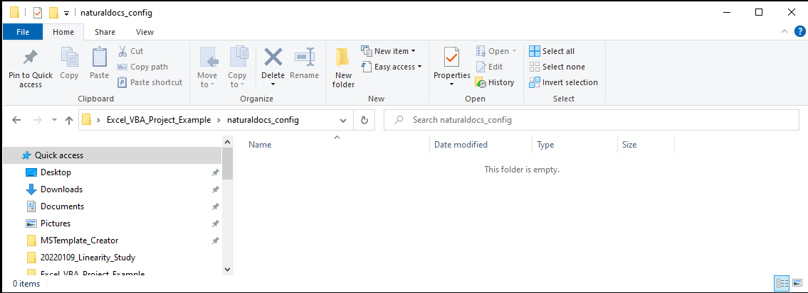

Next, go to the folder where Natural Docs is installed and create a shortcut to the Natural Docs.exe file.


The shortcut should be created in the Desktop. Move the shortcut file in the project folder.

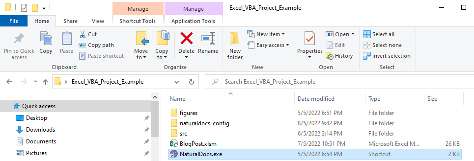

Open the shortcut properties.


In the Target section, fill in the command lines.

`"C:\Program Files (x86)\Natural Docs\NaturalDocs.exe" naturaldocs_config --pause-before-exit`

Or

`{Pathway to NaturalDocs exe file} {Pathway to Configuration folder} -- pause-before-exit`

In the Start in section, fill in the file path where the project folder is


Double clicking on the shortcut exe file will give the following.

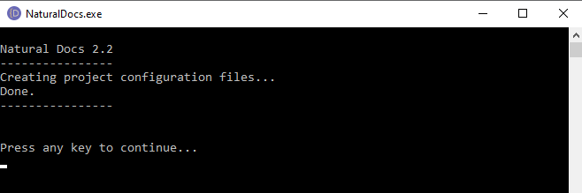

Three configuration file should be created.

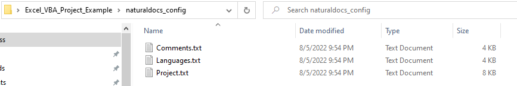

Lastly, create an empty folder called `docs` in the project folder `Excel_VBA_Project_Example`. This is where the Natural Docs will output the code documentation.

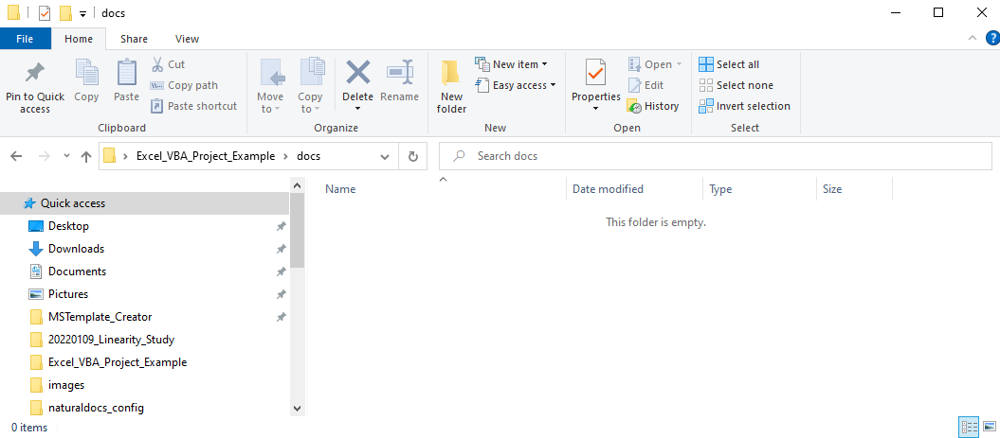

### Natural Docs configuration files

Now it is time to edit the configuration files to tell Natural Docs some critical information for it to run properly.

The references of each configuration file can be found as follows:

-   [`Project.txt`](https://www.naturaldocs.org/reference/project.txt/)
-   [`Languages.txt`](https://www.naturaldocs.org/reference/languages.txt/)
-   [`Comments.txt`](hhttps://www.naturaldocs.org/reference/comments.txt/)

In this project example, I have made to following important changes.

In `Project.txt`, I have stated the title, subtitle, copyright, source folder in which Natural Docs will look for input files, image folder in which Natural Docs will look to get the image file to link in the code documentation, HTML Output folder in which Natural Docs will output the code documentation files.

```r
Format: 2.2

# This is the main file you use to configure Natural Docs for your project.


# Project Information
# ------------------------------------------------------------------------

Title: My Project Name
Subtitle: Version 0.0.0.9000

Copyright: Copyright © 2022 My Name, My Affiliation

Timestamp: Last updated 5 6, 2022

# Source Code
# ------------------------------------------------------------------------

Source Folder: ..\src
   Name: BlogPost
   
# Images
# ------------------------------------------------------------------------

Image Folder: ..\figures\code_documentation

# Generated Documentation
# ------------------------------------------------------------------------

HTML Output Folder: ..\docs

```

In `Languages.txt`, I have stated the programming language name, the line comment symbol to tell Natural Docs which part of the excel VBA file is the code documentation, the excel VBA line extender symbol and indicate that excel VBA is case sensitive.

While `'` is the actual line comment symbol for excel VBA, we use `''` instead to represent code documentation to differentiate between general comments and `'@` used by Rubberduck.

```r
# Languages
# ------------------------------------------------------------------------
# The syntax reference is after the definitions.

Language: Excel VBA

   Line Comment: ''
   Line Extender: _
   Case Sensitive: Yes
```

No modification is made in `Comments.txt`

### Code documentation

Take a look at 


### MSTemplate_Creator example

Here is the [MSTemplate_Creator example](https://slinghub.github.io/MSTemplate_Creator/)

## Excel Module Code

Here are the VBA codes for all the modules given.



```r
Option Explicit
'@Folder("Export VBA Source Code Functions")
'@IgnoreModule IntegerDataType

'' Function: Export_Visual_Basic_Code
''
'' Description:
''
'' Export all VBA source codes to a user selected folder.
''
'' The function will first open a pop up box to allow users
'' to select a folder.
''
'' (see Utilities_Get_Folder.png)
''
'' After the folder is selected, the VBA source codes
'' will be exported to that folder.
''
'' (see Export_VBA_Output.png)
''
'' Do note that files will be overwritten without warning.
''
Public Sub Export_Visual_Basic_Code()
    'https://gist.github.com/steve-jansen/7589478
    Const Module As Integer = 1
    Const ClassModule As Integer = 2
    Const Form As Integer = 3
    Const Document As Integer = 100
    'Const Padding As Integer = 24
    
    Dim VBComponent As Object
    Dim Count As Integer
    Dim Path As String
    Dim Directory As String
    Dim Extension As String
    
    ' Folder must exist prior to outputting the source file
    Directory = Utilities.Get_Folder()
    If Directory = vbNullString Then
        Exit Sub
    End If
    
    Count = 0
    
    For Each VBComponent In ActiveWorkbook.VBProject.VBComponents
        Select Case VBComponent.Type
            Case ClassModule, Document
                Extension = ".cls"
            Case Form
                Extension = ".frm"
            Case Module
                Extension = ".bas"
            Case Else
                Extension = ".txt"
        End Select
            
                
        On Error Resume Next
        Err.Clear
        
        Path = Directory & "\" & VBComponent.Name & Extension
        VBComponent.Export Path
        
        If Err.Number <> 0 Then
            MsgBox "Failed to export " & VBComponent.Name & " to " & Path, vbCritical
        Else
            Count = Count + 1
            'Debug.Print "Exported " & Left$(VBComponent.Name & ":" & Space(Padding), Padding) & path
        End If

        On Error GoTo 0
    Next
    
    MsgBox "Successfully exported " & CStr(Count) & " VBA files to " & Directory

End Sub
```


```r
Option Explicit
'@Folder("Utilities Functions")

'' Function: Get_Folder
''
'' Description:
''
'' Get the file path of a folder selected by the user.
''
'' The function will first open a pop up box to allow users
'' to select a folder.
''
'' (see Utilities_Get_Folder.png)
''
'' After the folder is selected, the file path of the folder is returned
''
'' Returns:
''    Returns the file path of a folder selected by the user
Public Function Get_Folder() As String
    'https://stackoverflow.com/questions/26392482/vba-excel-to-prompt-user-response-to-select-folder-and-return-the-path-as-string
    Dim Folder As FileDialog
    Dim Selected_Item As String
    Set Folder = Application.FileDialog(msoFileDialogFolderPicker)
    With Folder
        .Title = "Select a Folder"
        .AllowMultiSelect = False
        .InitialFileName = Application.DefaultFilePath
        If .Show <> -1 Then GoTo NextCode
        Selected_Item = .SelectedItems.Item(1)
    End With
NextCode:
    Get_Folder = Selected_Item
    Set Folder = Nothing
End Function

```


```r
Option Explicit

'@Folder("QC_Sample_Type_Identification")

'' Function: Is_EQC
''
'' Description:
''
'' Check is the input string (sample name) is an EQC.
''
'' Parameters:
''
''    FileName - Input string to check if it is an EQC
''
'' Returns:
''    A boolean (True or False). Return True if
''    the input string contains "EQC", "Eqc", "eqc"
''
'' Examples:
''
'' --- Code
''    Dim EQCTestArray As Variant
''    Dim arrayIndex As Integer
''
''    EQCTestArray = Array("EQC", "001_EQC_TQC prerun 01")
''
''    For arrayIndex = 0 To UBound(EQCTestArray) - LBound(EQCTestArray)
''        Debug.Print Sample_Type_Identifier.Is_EQC(CStr(EQCTestArray(arrayIndex))) & ": " & _
''                    EQCTestArray(arrayIndex)
''    Next
'' ---
Public Function Is_EQC(ByVal FileName As String) As Boolean
    Dim NonLettersRegEx As RegExp
    Set NonLettersRegEx = New RegExp
    Dim EQCRegEx As RegExp
    Set EQCRegEx = New RegExp
    Dim OnlyLettersText As String
    NonLettersRegEx.Pattern = "[^A-Za-z]"
    NonLettersRegEx.Global = True
    
    EQCRegEx.Pattern = "(EQC|[Ee]qc)"
    OnlyLettersText = Trim$(NonLettersRegEx.Replace(FileName, " "))
    Is_EQC = EQCRegEx.Test(OnlyLettersText)
    
End Function
```


```r
Option Explicit
Option Private Module

'@TestModule
'@Folder("Tests")

Private Assert As Object
'Private Fakes As Object

'@ModuleInitialize
Public Sub ModuleInitialize()
    'this method runs once per module.
    Set Assert = CreateObject("Rubberduck.AssertClass")
    'Set Fakes = CreateObject("Rubberduck.FakesProvider")
End Sub

'@ModuleCleanup
Public Sub ModuleCleanup()
    'this method runs once per module.
    Set Assert = Nothing
    'Set Fakes = Nothing
End Sub

'@TestMethod("Get QC Sample Type")

'' Function: Is_EQC_Test
''
'' Description:
''
'' Function used to test if the function
'' Sample_Type_Identifier.Is_EQC is working
''
'' Test data are
''
''  - A string array EQCTestArray
''
'' Function will assert if Sample_Type_Identifier.Is_EQC gives
'' True to all entries in EQCTestArray
''
Public Sub Is_EQC_Test()
    On Error GoTo TestFail
    
    Dim EQCTestArray As Variant
    Dim arrayIndex As Integer
    
    EQCTestArray = Array("EQC", "001_EQC_TQC prerun 01")
           
    For arrayIndex = 0 To UBound(EQCTestArray) - LBound(EQCTestArray)
        'Debug.Print Sample_Type_Identifier.Is_EQC(CStr(EQCTestArray(arrayIndex))) & ": " & _
                     EQCTestArray(arrayIndex)
        MsgBox Sample_Type_Identifier.Is_EQC(CStr(EQCTestArray(arrayIndex))) & ": " & _
                     EQCTestArray(arrayIndex)
        Assert.IsTrue (Sample_Type_Identifier.Is_EQC(CStr(EQCTestArray(arrayIndex))))
    Next

    GoTo TestExit
TestExit:
    Exit Sub
TestFail:
    Assert.Fail "Test raised an error: #" & Err.Number & " - " & Err.Description
End Sub
```




<https://vimeo.com/138774243>
