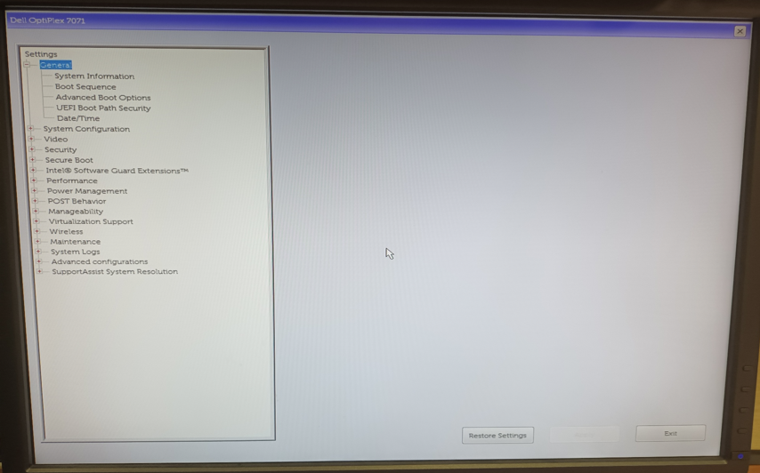
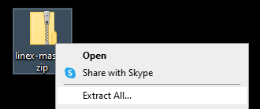
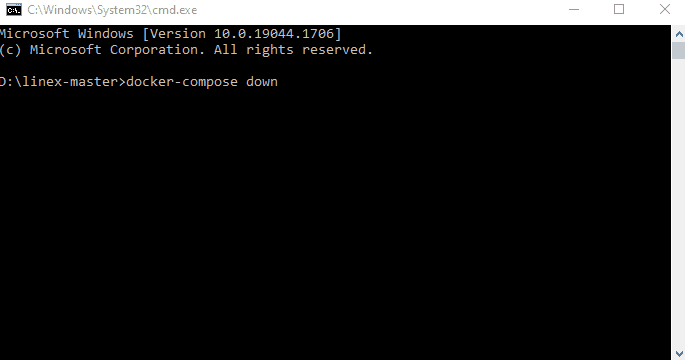
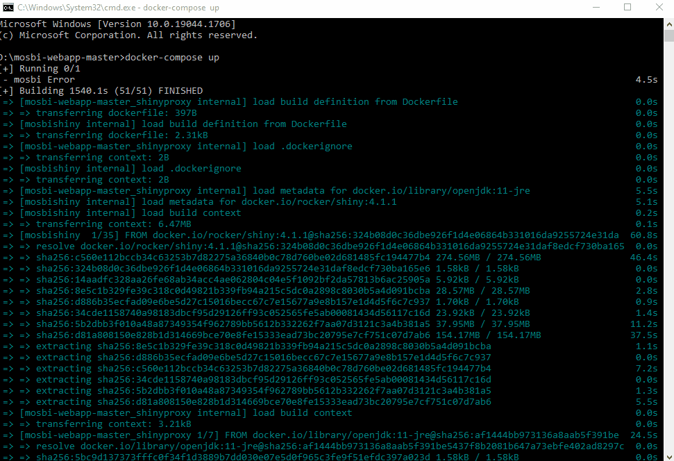

## Introduction

[Docker](https://www.docker.com/) 🐳 (1) has been gaining in popularity in the academic field to ensure scripts that are used to run on research data can be easily opened and explored by others. A picture friendly introduction of Docker can be found in this [Devopedia webpage](https://devopedia.org/docker).

As someone who has just started to learn how to use this in a non-computing academic lab, the onboarding learning curve for Docker just to reproduce other people works is already quite a challenge for me 😅.

In this blog, I will try to share what I have learnt by providing a step by step walk-through with pictures to show on how to install Docker 🐳 in Windows 10 and use it recreate two lipidomics software web services 🌐, one made using [Django](https://www.djangoproject.com/) called [LINEX](https://exbio.wzw.tum.de/linex/) (2), (3) and the the other using [Shiny](https://shiny.rstudio.com/) called [MoSBi](https://exbio.wzw.tum.de/mosbi/) (4). Both software are from [LipiTUM](https://www.lipitum.de/Home). I pick these two software because the end results are tangible and do not take too long to build using Docker (once it is successfully installed).

Hope that this is helpful for those who just want to use Docker 🐳 to reproduce an open source web application 🌐.

Do note that I am using the Windows Subsystem for Linux (WSL) 2 back end approach to install Docker 🐳.

## Benefits of Docker

Since both LINEX and MoSBi already have web services available, As a user, why is there a need to go through all these effort to rebuild them in Docker? Well, there are a few reasons.

Firstly, there are no guarantees that the links to these web service will run forever, Docker containers can be seen as a plan B, or a business continuity plan, to resume data analysis should the existing link no longer works and need some time to be updated.

Moreover, web applications generated using Docker containers can run on data analysis computers without internet access. This allows users to run these web applications without fear of accidental data leakage into the web.

In addition, versions of these web applications will be updated over time. As a results, given the same input, results generated by these web applications today may be different in the future. As a Docker container, like a time capsule, is able to preserve the source code, data, documentation, and the computing environment. This ensures that the same results are produced at any time as long as the same container is used.

Furthermore, having the same Docker container also means errors generated from these web applications can be reproduced by the maintainers more easily. Bugs that can be reproduced by the maintainers usually takes a shorter time to be fixed, benefiting the users in the long run.

## About LINEX

[LINEX](https://exbio.wzw.tum.de/linex/) or Lipid Network EXplorer is one of the many lipidomics software used to analyse and visualise lipid metabolic networks. This is essential in helping us better understand functional association between lipids. As a result, it provides a more reliable biological interpretation of a given lipidomics experiment.

While there is a [web service](https://exbio.wzw.tum.de/linex/) available, LINEX also offers a different approach by running it in a [Docker](https://www.docker.com/) environment as well. A short instruction is provided in their [GitLab website](https://gitlab.lrz.de/lipitum-projects/linex).

## About MoSBi

On the other hand, [MoSBi](https://exbio.wzw.tum.de/mosbi/) or Molecular Signatures with Biclustering is a software tool used to stratify samples based on lipidomics data (or any molecular omics data in general). The unique thing about this software is that it creates biclusters by combining several biclustering algorithms via an ensemble approach. This is to ensure that the bicluster results are more robust to changes in the data sets.

MoSBi is available as an [R package](https://github.com/tdrose/mosbi) in [Bioconductor](https://bioconductor.org/packages/release/bioc/html/mosbi.html), a [web service](https://exbio.wzw.tum.de/mosbi/) as well as the option to be created using [Docker](https://www.docker.com/) from this [GitLab website](https://gitlab.lrz.de/lipitum-projects/mosbi-webapp).

## Windows 10 set up

We will now proceed with the steps to install Docker in Windows 10 successfully.

The minimal settings to have Docker with WSL 2 backend in Windows can be found in this installation [web site](https://docs.docker.com/desktop/windows/install/)

The biggest challenge is to get WSL 2 to work in Windows 10.

While the list of requirements can be daunting, the good news is that the Docker Installer for Windows will help automatically download and install WSL 2 and will prompt you to update the WSL 2 Linux kernel as well after installation.

### Windows 10 specifications

A 64-bit processor with Second Level Address Translation (SLAT) and a minimum of 4GB system RAM are required to run WSL 2 on Windows 10.

Here are my Windows 10 settings

Clearly, the RAM part is satisfied and I am using a 64 bit machine.

To check if I have SLAT, firstly, ensure that you have administrative rights on your computer.

Go to Control Panel.

Click on Program in green.

Click on Turn Windows feature on or off.

Windows Feature will be opened and scroll down and expand Hyper-V and see if Hyper-V-Platform is not masked or grey out. If so, the CPU supports SLAT. This is because SLAT is required for a successful Hyper-V installation.

More information can be found in this [webpage](https://www.kunal-chowdhury.com/2012/11/second-level-address-translation-slat-in-hyperv.html)

### Enable Virtual Machine Platform Windows Feature

This is required for WSL 2 to work on Windows 10.

To enable this, firstly, ensure that you have administrative rights on your computer and internet connection.

Open Windows Feature (following the steps from the previous section Windows 10 specifications) and check on the box “Virtual Machine Platform” and click OK.

Windows will search the internet for the necessary files and apply the changes. You will be prompted to restart the computer after the change is applied.

### Virtualization enabled in the BIOS

This is required for WSL 2 to work on Windows 10.

I am using a Dell Optiplex 7071 Tower Desktop. According to this [specifications website](https://www.dell.com/support/manuals/en-sg/optiplex-7071-desktop/optiplex7071_setup/virtualization-support?guid=guid-e0672e00-c1cf-4ad5-9575-a1f762bae383&lang=en-us), the virtualization is enabled by default.

To confirm this, referring to this [stack overflow question](https://stackoverflow.com/questions/49005791/how-to-check-if-intel-virtualization-is-enabled-without-going-to-bios-in-windows#:~:text=If%20you%20have%20Windows%2010,is%20currently%20enabled%20in%20BIOS.), open Task Manager and click on the Performance Tab and then CPU.

Here my Virtualization settings is labelled as “Enabled”.

If it shows “Disabled”, you will need to enable it in BIOS. If you don’t see “Virtualization”, it means that the CPU does not support virtualization and Docker unfortunately cannot be used in this computer.

To enabled virtualization in BIOS from a Dell Optiplex 7071 Tower Desktop, you will need to get to the BIOS menu. To do so, restart the computer. When the monitor screen shows that the computer has switched off, press the “F12” button to access the Boot Options. Go to BIOS Setup and press Enter.

You will be led to this BIOS menu.

Expand the Virtulization tab and click on Virtualization and check “Enable Intel Virtualization Technology”

Some computers may require this as well, click on VT for Direct I/O and check “Enable VT for Direct I/O”

## Docker in Windows 10

### Docker Desktop for Windows Installation

With the above Windows 10 settings completed, we can now proceed with the Docker installation.

Go to the Docker [installation website](https://docs.docker.com/desktop/windows/install/) to download Docker Desktop for Windows. The current Docker Desktop version is 4.8.2

Double click on this file will give the following. Check both boxes and click Ok.

Installation will proceed

and when it is done. Click Close and restart to allow Windows to restart and complete the installation.

After restarting, the Docker Desktop shortcut icon will appear.

Double click on this will lead to a service agreement. Check on “I accept the terms” anf click the Accept button.

### Installation of WSL 2 kernel update

After accepting the service agreement, a pop up will appear saying that WSL2 installtion is incomplete. This is because, we have yet to install the WSL 2 kernel updates.

No need to worry. Just click on the link provided and you should be let to this [webpage](https://docs.microsoft.com/en-us/windows/wsl/install). Do not attempt to close this message box as we will come back to it later.

Simply click “WSL 2 Linux kernel update package for x64 machines”

and double click on the installation file to give the Windows Subsystem for Linux Update setup wizard.

Click on Next to proceed with the installation.

Click on Finish to complete the installation.

Go back to this pop up message box and click Restart

This will allow Docker Desktop for Windows to restart

This time it should open without errors with this tutorial page.

You may wish to take time to go through the tutorial. Else you may skip it which will bring you to this home page.

To confirm that WSL 2 is successfully installed and it being used by Docker, go to Settings,

Look at the General Tab. You will see that “Use the WSL 2 based engine” should be checked.

With Docker installed in Windows 10, we can now proceed to run the two lipidomics software in the Docker environment.

## LINEX in Windows 10 Docker

The instruction to run LINEX using Docker can be found in this [GitLab webpage](https://gitlab.lrz.de/lipitum-projects/linex).

Nevertheless, I will try to provide a more detailed procedure on how this can be done in Windows 10 for the sake of those who are unfamiliar with the workings of Windows 10.

### Software download

The first step is to download the repository. For Windows 10, we can download it as a zip file.

To unzip it, right click the zip folder and click on Extract All…

In my example, I choose to extract it on the D drive.

### Docker Excecution

After extraction, open Command Prompt in the current folder by going to the folder location and type “cmd” on the address bar.

In this command prompt, type `docker-compose up -d` as instructed by the [GitLab webpage](https://gitlab.lrz.de/lipitum-projects/linex). This is what you should see.

Once the process is completed, go back to Docker Desktop for Windows and click on Containers, Volumes and Images. This is what you should see.

### Running LINEX

With a working Docker container, we can open the LINEX web page in our local server using `http://127.0.0.1:8084` as recommended in the [GitLab website](https://gitlab.lrz.de/lipitum-projects/linex)

### Closing session

We can close the container using the `docker-compose down`

## MoSBi in Windows 10 Docker

The instruction to run MoSBi web application using Docker can be found in this [GitLab webpage](https://gitlab.lrz.de/lipitum-projects/mosbi-webapp).

The steps are similar to the previous section.

### Software download

Download the repository first. For Windows 10, we can download it as a zip file.

To unzip it, right click the zip folder and click on Extract All…

In my example, I choose to extract it on the D drive.

### Docker Excecution

After extraction, open Command Prompt in the current folder by going to the folder location and type “cmd” on the address bar.

In this command prompt, type `docker-compose up` as instructed by the [GitLab webpage](https://gitlab.lrz.de/lipitum-projects/mosbi-webapp). The process will take some time to run but this is what you should see when everything is done.

In this scenario, **do not** close the command prompt.

In the Docker Desktop for Windows, the following Containers and Images will be running

### Running MoSBi

With a working Docker container, we can open the MoSBi web page in our local server using `http://127.0.0.1:8082` as recommended in the [GitLab website](https://gitlab.lrz.de/lipitum-projects/mosbi-webapp)

When the web page is running, a new container will be created in Docker Desktop for Windows. In my example, it is called “optimistic_shtern”.

### Closing session

To stop the web service, go back to the command prompt and press “Ctrl+C” on the keyboard. This is what you should see.

After that, remember to go back to Docker Desktop for Windows and stop the MoSBi `shiny` container from running.

## Conclusion

If you have followed me this far successfully 😅, then congratulations 🎉, you have managed to recreate two open source web applications 🌐 using Docker 🐳. Unfortunately, I have to apologise 😓 that I lack the knowledge currently to fully explain why these Docker command work and what are they doing. For now, I am just going to try out these cool web applications.

Once again, I do hope that this is helpful in your learning journey with Docker 🐳 and to see its usefulness in recreating someone else’s open source software.

## Image References

Docker 🐳 logo is taken from this [media resource webpage](https://www.docker.com/company/newsroom/media-resources/) used under their [trademark guidelines](https://www.docker.com/legal/trademark-guidelines/).

## References

1. Merkel D. Docker: Lightweight linux containers for consistent development and deployment. Linux Journal \[Internet\]. 2014 Mar;2014(239). Available from: <https://dl.acm.org/doi/10.5555/2600239.2600241>

2. Köhler N, Rose TD, Falk L, Pauling JK. Investigating global lipidome alterations with the lipid network explorer. Metabolites \[Internet\]. 2021;11(8). Available from: <https://www.mdpi.com/2218-1989/11/8/488>

3. Rose TD, Köhler N, Falk L, Klischat L, Lazareva OE, Pauling JK. Lipid network and moiety analysis for revealing enzymatic dysregulation and mechanistic alterations from lipidomics data. bioRxiv \[Internet\]. 2022; Available from: <https://www.biorxiv.org/content/early/2022/05/23/2022.02.04.479101>

4. Rose TD, Bechtler T, Ciora OA, Le KAL, Molnar F, Köhler N, et al. MoSBi: Automated signature mining for molecular stratification and subtyping. Proceedings of the National Academy of Sciences \[Internet\]. 2022;119(16):e2118210119. Available from: <https://www.pnas.org/doi/abs/10.1073/pnas.2118210119>

