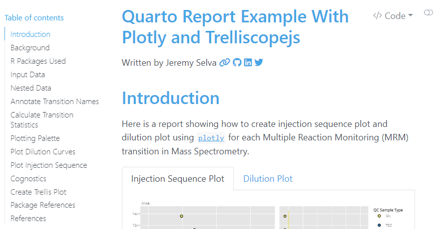

## Introduction

I have created this [html report](https://jauntyjjs.github.io/Trelliscopejs_In_Quarto_Example/) in [Quarto](https://quarto.org/) to show how to create some interactive quality control plots using [`plotly`](https://plotly.com/r/) and display as a trellis using [`trelliscopejs`](https://hafen.github.io/trelliscopejs/).

The source code used to generate this report can be found in this [GitHub page](https://github.com/JauntyJJS/Trelliscopejs_In_Quarto_Example).

## Background

Here is some background knowledge about the use of the quality control (QC) plots, for example, the injection sequence plot and the dilution plot, in targeted lipidomics analysis.

### About Targeted Lipidomics

The peak area data used to generate these quality control plots comes from a targeted lipidomics experiment using Reversed-Phase Ultra High-Performance Liquid Chromatography/ Mass Spectrometry (RP-UHPLC/MS).

For those new to mass spectrometry or lipidomics, the aim of targeted lipidomics is to measure and even quantify the amount of specific lipids found in a given sample. To tell the mass spectrometer what lipids to measure, a list of multiple reaction monitoring (MRM) transitions (with their corresponding precursor and product ions) is provided. More details on what multiple reaction monitoring (MRM) is can be found in this [webpage](https://www.proteomics.com.au/analytical-services/srms-mrm/) by Proteomics International Laboratories LTD.

### Reason for creating quality control (QC) plots

However, variation in a transition’s peak area measured between samples can come from many unwanted sources, besides that sample itself. Such unwanted sources includes, contaminant ions or a different pipette used during lipid extraction. To check the severity of these unwanted variation, quality control (QC) samples are used.

In most practices, we want to keep transitions that give peak areas with low variation in the quality control samples. While variations can be measured using summary statistics such as the coefficient of variation, creating quality control (QC) plots can help us identify the cause of the unwanted variation. In this report, two such plots are introduced.

The injection sequence plot is a scatter plot with the peak area (or concentration) on the y-axis and the injection sequence order (or data acquisition time) on the x axis. This is to better understand the variation of peak area in the quality control (QC) sample types over time. A [raincloud plot](https://wellcomeopenresearch.org/articles/4-63) is placed on the right of the scatter plot to show the distribution of each (QC) sample type as well as to highlight any potential outliers.

The dilution plot, on the other hand, checks for possible signal enhancement or suppression as a result of [detector saturation](https://www.researchgate.net/figure/llustration-of-the-saturation-of-the-MCP-detector-caffeine-m-z-1950882-as-an_fig2_221846657) or [matrix effect](https://www.slideshare.net/amitpatel745/matrix-effect-7614914).

## Conclusion

I hope the above explanation provides a good head-ups on what is to come in the later parts of the [html report](https://jauntyjjs.github.io/Trelliscopejs_In_Quarto_Example/). May its resources be useful in your work though it may be specific to a small part of targeted lipidomics analysis.
