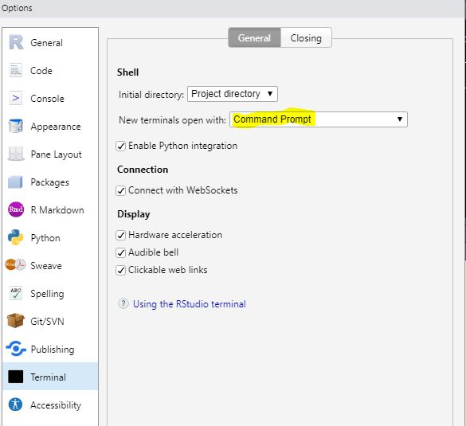
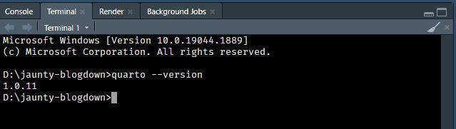
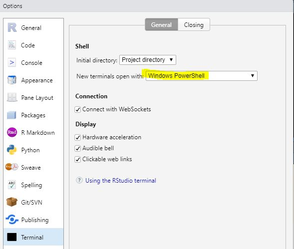
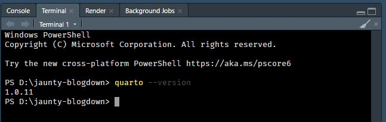
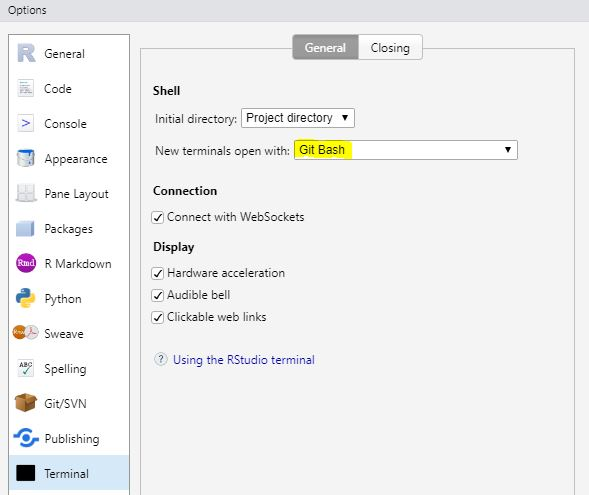
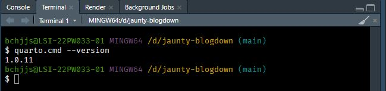
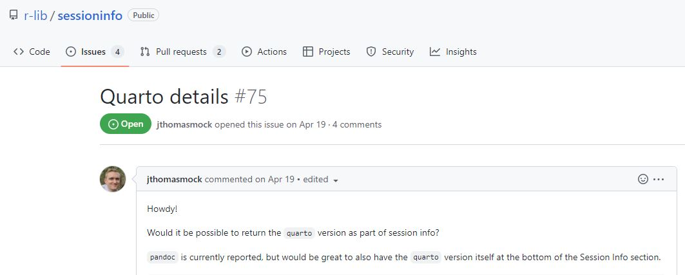
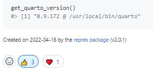

## Introduction

Time flies since the last conference that I have attended. I am fortunate to be given a chance to attend the [R/Medicine 2022 Conference](https://events.linuxfoundation.org/r-medicine/) and give a lightning talk as well.

The general goal of R/Medicine Conference is to help practitioners in clinical and medicine sciences improve the quality of their research workflow with the use of R based tools. The focus is mainly on the application of R to create effective workflows and applications that promote reproducible data processing, reporting and visualisation.

Despite having to attend the conference in the middle of the night ... again, it is indeed a fruitful experience. Here is a write up about my experiences in the conference for Day 1 and Day 2.

## Day 1

I had attended two workshops: Clinical Reporting with [gtsummary](https://www.danieldsjoberg.com/gtsummary/) and Using Public Data and Maps for Powerful Data Visualization.

### Clinical Reporting with [gtsummary](https://www.danieldsjoberg.com/gtsummary/)

I actually never create a clinical summary table before but have heard from other colleagues about how difficult it is to do this in Excel and transfer the tabular results to Word. Things get pretty ugly when the table needs to be updated because of a new influx of study samples or/and the number of clinical information that needs to be reported is large. Having an R package like [gtsummary](https://www.danieldsjoberg.com/gtsummary/) that is able to create such reports automatically is beneficial to the medical community.

The course was led by [Daniel Sjoberg](https://twitter.com/statistishdan), with [Shannon Pileggi](https://twitter.com/PipingHotData) and [Karissa Whiting](https://twitter.com/karissawhiting) assisting in answering most of the Q & A and [consolidating them together](https://www.danieldsjoberg.com/clinical-reporting-gtsummary-rmed/q-and-a.html). It turns out that [gtsummary](https://www.danieldsjoberg.com/gtsummary/) is an extension of the R package [gt](https://gt.rstudio.com/), designed to make publication ready tables. Other extensions of [gt](https://gt.rstudio.com/) are [gtExtras](https://jthomasmock.github.io/gtExtras/) and a recent one for reporting adverse events called [gtreg](https://shannonpileggi.github.io/gtreg/). [gtreg](https://shannonpileggi.github.io/gtreg/) will be presented by Shannon during the R/Medicine 2022 Conference as well.

The first part of the course was to use [gtsummary](https://www.danieldsjoberg.com/gtsummary/) to create a table of statistical summaries using [`tbl_summary`](https://www.danieldsjoberg.com/gtsummary/articles/tbl_summary.html). It went on further on how to customize its output using functions like [`add_p`](https://www.danieldsjoberg.com/gtsummary/articles/tbl_summary.html), [`add_overall`](https://www.danieldsjoberg.com/gtsummary/reference/add_overall.html) and [`add_difference`](https://www.danieldsjoberg.com/gtsummary/reference/add_difference.html). An overview of [`tbl_summary`](https://www.danieldsjoberg.com/gtsummary/articles/tbl_summary.html) can be found in this [tutorial](https://www.danieldsjoberg.com/gtsummary/articles/tbl_summary.html).

The second part of the course was about reporting regression results as a table using [`tbl_regression`](https://www.danieldsjoberg.com/gtsummary/reference/tbl_regression.html). It was amazing that the program was able to create a report table that shows (by a dash line) which group in a categorical variable is used as a control. Felt a bit bad for asking how to change the dash line to "Ref.". It turned out the way to do this is not so trivial. See Q16 of the [Q & A](https://www.danieldsjoberg.com/clinical-reporting-gtsummary-rmed/q-and-a.html) for the answer. An overview of [`tbl_regression`](https://www.danieldsjoberg.com/gtsummary/reference/tbl_regression.html) can be found in this [tutorial](https://www.danieldsjoberg.com/gtsummary/articles/tbl_regression.html).

The last part was using [`inline_text`](https://www.danieldsjoberg.com/gtsummary/reference/inline_text.html) to give a short summary of what the report table is trying to show. An overview of [`inline_text`](https://www.danieldsjoberg.com/gtsummary/reference/inline_text.html) can be found in this [tutorial](https://www.danieldsjoberg.com/gtsummary/articles/inline_text.html).

Due to a lack of time, the instructor quickly went through ways to combine different summary tables, summary table theming and print engines. Overall, it is a very informative session and I have learned a lot from it.

-   📝[Course Material](https://www.danieldsjoberg.com/clinical-reporting-gtsummary-rmed/)
-   📝[Course Slides](https://www.danieldsjoberg.com/clinical-reporting-gtsummary-rmed/slides)

### Using Public Data and Maps for Powerful Data Visualization.

The course was conducted by [Joy Payton](https://twitter.com/kjoypayton), who is currently working in the [Children's Hospital of Philadelphia (CHOP) Research Institute](https://education.arcus.chop.edu/). The session was about learning how to use R to access public data sets with the use of Application Programming Interface, or API in short, and to do geospatial analysis with the data received.

Despite having limited experience in doing such analysis, I was able to follow the course without much trouble. Joy had made a lot of effort on the [course slides](https://rpubs.com/pm0kjp/r_medicine_2022) to make it comprehensible to an audience with limited computing experience.

The course started with a gentle introduction on the API and how the API could be used with R to extract relevant information from the public databases automatically, reducing the need to type many web addresses and click on several buttons repeatedly just to get access to the data. The exercises consist of ways to get information from the
- [PubMed database](https://pubmed.ncbi.nlm.nih.gov/) using the R package [`easyPubMed`](https://cran.r-project.org/web/packages/easyPubMed/index.htmlhttps://cran.r-project.org/web/packages/easyPubMed/index.html) to communicate with the API
- [Socrata database](https://dev.socrata.com/) manually using Socrata Open Data API (SODA) to get some map data. Users may consider using [`RSocrata`](https://github.com/Chicago/RSocrata) to obtain data as well.

The course then focused on ways to extract geospatial data from the web and plot them using the R package [`leaflet`](https://rstudio.github.io/leaflet/). Two type of map files were used during the course namely [GeoJSON](https://www.rfc-editor.org/rfc/rfc7946) and [Shapefile](https://www.esri.com/library/whitepapers/pdfs/shapefile.pdf).

The last part of the course was a revision on what had been taught earlier. This time using the [US Census Data](https://data.census.gov/cedsci/) from the [Census Bureau](https://www.census.gov/) as an example. The difference was that there was a need to obtain an API key by first signing up your email in this [webpage](https://api.census.gov/data/key_signup.html). Once the Census API key has been emailed to use, we can use the R package [`tidycensus`](https://walker-data.com/tidycensus/) to get relevant census and geospatial data to visualise the percentage of Latinos living in different parts of Philadelphia in 2010. This information was important for the decision makers to decide where to build a clinic that dedicated on Spanish language patient and meeting their health needs.

I had to admit that dealing with geospatial data could be daunting with a lot of jargon that I was not used to seeing. However, Joy's exercise notes were very useful for a newbie like me. The notes helped me understand what these jargon in the data meant and what the R script was doing on the data. Getting the code to run and see the nice results at the end is indeed rewarding.

-   📝[Course Material](https://github.com/pm0kjp/r-medicine-2022)
-   📝[Course Slides](https://rpubs.com/pm0kjp/r_medicine_2022)
-   📝Examples used
    -   [PubMed Counts of Articles](https://rpubs.com/pm0kjp/pubmed_api_example)
    -   [Opening Map Files](https://rpubs.com/pm0kjp/opening_map_files)
    -   [Mapping Data from Socrata/SODA](https://rpubs.com/pm0kjp/simple_maps_from_socrata)
    -   [Obtaining US Census Data](https://rpubs.com/pm0kjp/census_data)

## Day 2

For Day 2 of the conference, I have attended the following workshops: Differential Expression using R and Reproducible Research with Quarto.

### Differential Expression using R

[Siavash Ghaffari](https://ca.linkedin.com/in/siavash-ghaffari-6b300967) from [Procogia](https://procogia.com/) provided an overview on the workflow of Bulk RNA Sequence Analysis. While most of the workflow was done by other bioinformatics tools, R was used to do differential expression analysis.

The input data consisted of
- A read counts table of RNA sequence taken from five patients' tumour cells seeded into plates and treated with either DMSO (the control) or an LSD1 inhibitor for 24 hours.
- Additional information of the ten tumour cells.

The Bioconductor Package [DESeq2](https://bioconductor.org/packages/release/bioc/html/DESeq2.html) was used to do majority of the differential expression analysis such as,

-   Comparing log fold changes between the control group and treatment as well as using `apeglm` for effect size shrinkage.
-   Creating plots like Dispersion Plot `DESeq2::plotDispEsts`, MA plot `DESeq2::plotMA`.
-   Extracting a result table using `DESeq2::results`

Next, the ENSEMBL IDs in the results data set was mapped to human gene names using `AnnotationDbi::mapIds` before output them to csv files.

The workshop then proceeded to different ways to visualise the differential expression data. Prior to visualisation, the count data is first transformed using a variance stabalizing function `DESeq2::varianceStabilizingTransformation`. With the transformed data, several plots were created for example,

-   PCA plots using `DESeq2::plotPCA`
-   Hierarchical clustering and gene expression heat map using `ComplexHeatmap::Heatmap`
-   Volcano plots using `EnhancedVolcano::EnhancedVolcano`
-   Individual gene's read counts comparison plots in relation to clinical attributes using `ggplot2::ggplot`

It was a pity that we could not go through enrichment analysis which was what most participants were looking forward to. Nevertheless, it was a decent workshop for beginners like me. Hope to see the team conduct more of such workshops in the future.

-   📝[Course Material](https://github.com/developerpiru/GeneExpressionWorkshopRMed2022)

### Reproducible Research with [Quarto](https://quarto.org/)

The last workshop of the day was run by [Tom Mock](https://twitter.com/thomas_mock).

To date, I only managed to create two Quarto documents. One is a [lab work](https://jauntyjjs.github.io/islr2-bookclub-cohort3-chapter12-lab/) from a R for Data Science [book club](https://www.youtube.com/watch?v=pTys5kfA6Yc&ab_channel=R4DSOnlineLearningCommunity), the other is a [write up](https://jauntyjjs.github.io/Trelliscopejs_In_Quarto_Example/) on how to create interactive plots using [`plotly`](https://plotly.com/r/) and display them as trellis plot using [`trelliscopejs`](https://hafen.github.io/trelliscopejs/). Hopefully I could learn something new today.

When I realised that content of the workshop was going to be just slide presentations and demonstrations, I was initially worried that I would fall asleep because it was 3.30 am in where I am living and the content seemed quite technical (if you have little programming experience, it can be hard to understand things like Jupyter, Lua, Bootstrap, Javascript, etc...). It was a miracle that I was able to pull through till around 7am and ask a few questions along the way. Special thanks 🙏 to the one who asked if Howard, the instructor's pet dog seen in most of the slides, was given extra treats/food for contributing heavily to the course content. That really cracked me up internally though I could not laugh loudly because everyone else was asleep in where I lived.

At least it is comforting to know that I can still create [Github Flavoured Markdown](https://quarto.org/docs/output-formats/gfm.html) documents using Quarto and a [hugo](https://quarto.org/docs/reference/formats/markdown/hugo.html) option is presence as well. This blog originally come from a Quarto `.qmd` file

As for the issue of calling quarto in the terminal of RStudio, for my computer, both Windows 10 Command Line and PowerShell uses `quarto`.

<figure>

<figcaption aria-hidden="true">Command Prompt Option</figcaption>
</figure>

<figure>

<figcaption aria-hidden="true">Command Line Results</figcaption>
</figure>

<figure>

<figcaption aria-hidden="true">PowerShell Option</figcaption>
</figure>

<figure>

<figcaption aria-hidden="true">PowerShell Results</figcaption>
</figure>

On the other hand, Git Bash uses `quarto.cmd` for my computer.

<figure>

<figcaption aria-hidden="true">Git Bash Option</figcaption>
</figure>

<figure>

<figcaption aria-hidden="true">Git Bash Results</figcaption>
</figure>

There is currently work in progress to make the version of the Quarto used during the R session available in`session Info` in this [GitHub Issue](https://github.com/r-lib/sessioninfo/issues/75).

<figure>

<figcaption aria-hidden="true">Session Info</figcaption>
</figure>

Do give your support.

<figure>

<figcaption aria-hidden="true">Session Info</figcaption>
</figure>

I guess I will slowly look through the course material in my free time.

-   📝[Course Material](https://jthomasmock.github.io/quarto-r-medicine/)
-   📝[R Conference 2022 Course Material](https://github.com/jthomasmock/quarto-workshop)
-   📝[Tierney's Notes on Changing from Rmarkdown/Bookdown to Quarto](https://www.njtierney.com/post/2022/04/11/rmd-to-qmd/)
-   📝[Quarto Pub to publish and share Quarto documents](https://quartopub.com/)
