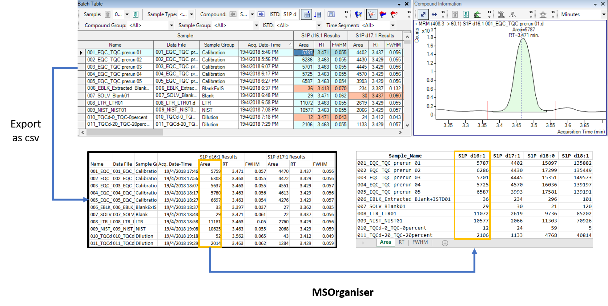

[`MSOrganiser`](https://github.com/SLINGhub/MSOrganiser) is created to provide users a convenient way to extract and organise MRM transition names data exported from mass spectrometry software into an Excel or csv file in a few button clicks.

With the addition of the [`MSTemplate_Creator`](https://github.com/SLINGhub/MSTemplate_Creator), the software is also able to normalize the peak area with respect to the internal standard’s peak area and calculate the concentration of the analytes.

