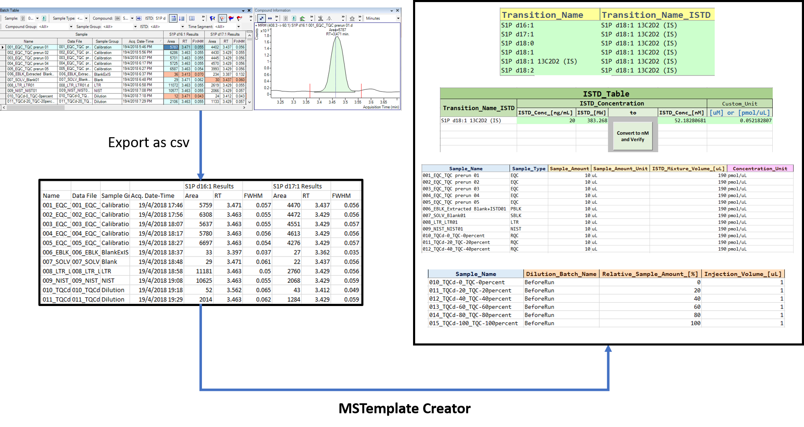

[`MSTemplate_Creator`](https://github.com/SLINGhub/MSTemplate_Creator) is an excel macro file created to provide users friendly interface to take in MRM transition names data exported directly from mass spectrometry software to create several annotation templates suited for automated data processing and statistical analysis.

