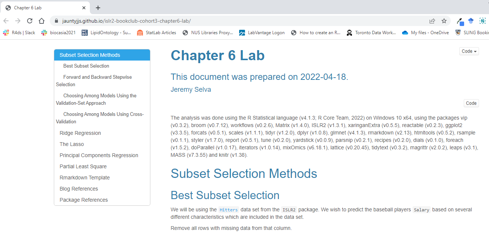

Here are the slides.

```{r, echo=FALSE}

xaringanExtra::embed_xaringan(
  url = "https://jauntyjjs.github.io/islr2-bookclub-cohort3-chapter6",
  ratio = "16:9"
)

```

Here is the [lab session](https://jauntyjjs.github.io/islr2-bookclub-cohort3-chapter6-lab).

```{r, echo=FALSE}

```

[Xaringan](https://github.com/yihui/xaringan) Slide NHS-R Theme Template by [Silvia Canelón](https://github.com/spcanelon/xaringan-basics-and-beyond)

Many thanks to [Irene Vrbik's blog](https://irene.vrbik.ok.ubc.ca/blog/2021-07-14-xaringan-slides/) for helping me learn more about Xaringan.
