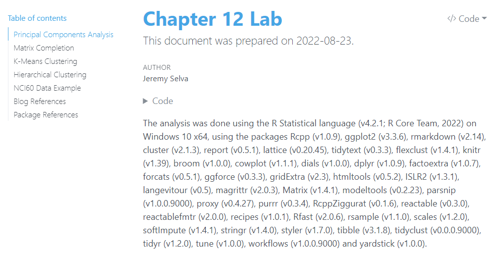

Here are the videos.

For this video, I was going through the contents of the book.

<iframe width="710" height="390" src="https://www.youtube.com/embed/bfOfGLEO_GQ" frameborder="0" allowfullscreen>
</iframe>

Here are the slides.

<iframe src="https://jauntyjjs.github.io/islr2-bookclub-cohort3-chapter12" width="1600" height="900" style="border:2px solid currentColor;" loading="lazy" allowfullscreen></iframe>

Here is the [lab session](https://jauntyjjs.github.io/islr2-bookclub-cohort3-chapter12-lab).

[Xaringan](https://github.com/yihui/xaringan) Slide NHS-R Theme Template by [Silvia Canelón](https://github.com/spcanelon/xaringan-basics-and-beyond)

Many thanks to [Irene Vrbik's blog](https://irene.vrbik.ok.ubc.ca/blog/2021-07-14-xaringan-slides/) for helping me learn more about Xaringan.
