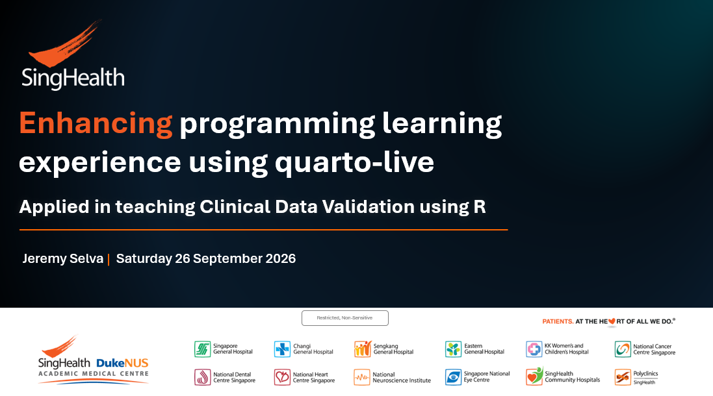

Here is the link to slides

   * <https://github.com/JauntyJJS/jaunty-blogdown/blob/main/content/talk/2026-09-26-SDEC-2026/Education_Conference_Slides.pdf>{target="_blank"}

{fig-alt="Title Slide of Enhancing programming learning experience using quarto-live."}

